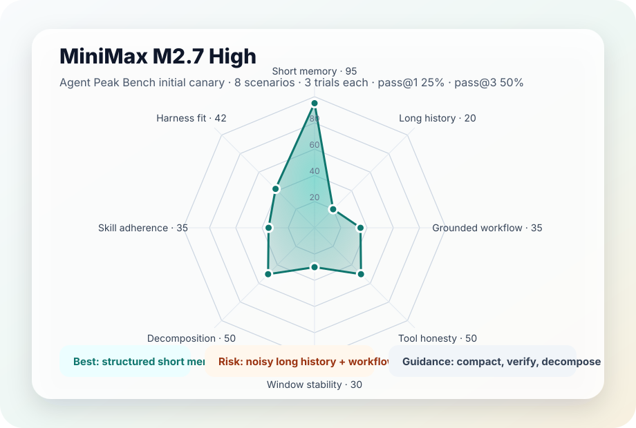
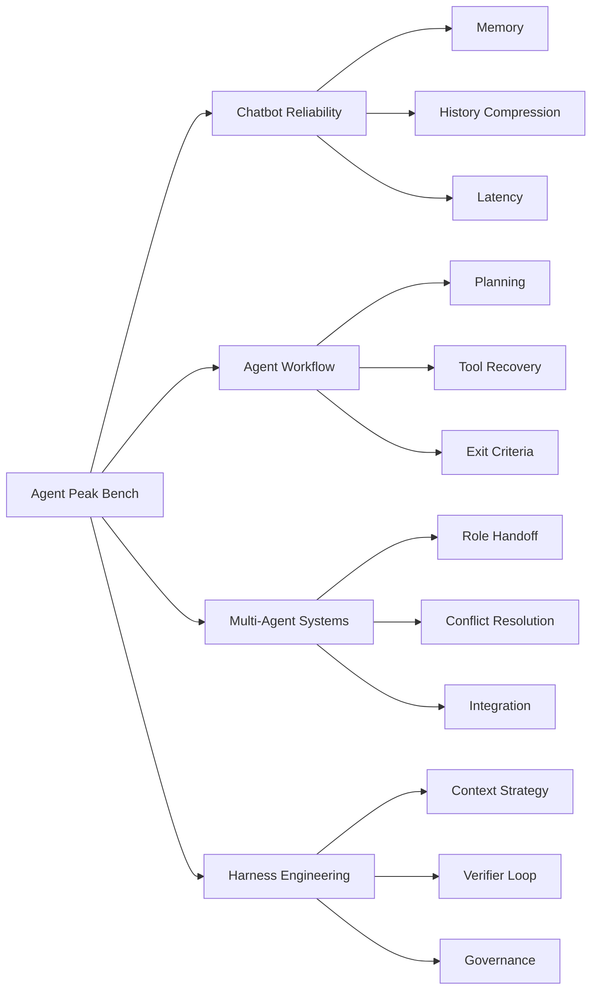
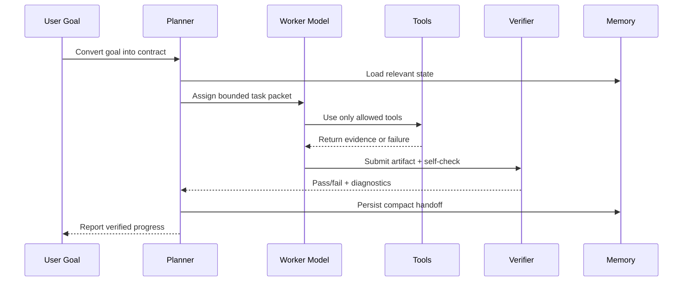

# Agent Peak Bench

<p align="center">
  <strong>Harness-first benchmark for evaluating whether agentic models stay useful under real engineering pressure.</strong>
</p>

<p align="center">
  <a href="https://2sao7sao.github.io/agent-peak-bench/"></a>
  <a href="./public/minimax-m27-high-summary.json"></a>
  <a href="./evals/benchmark_manifest_v2.json"></a>
  
</p>

<p align="center">
  <a href="./README.zh-CN.md">中文</a>
  ·
  <a href="https://2sao7sao.github.io/agent-peak-bench/">Interactive report</a>
  ·
  <a href="./docs/evaluation-samples.zh-CN.md">Evaluation samples</a>
  ·
  <a href="./report/enterprise-agent-benchmark-methodology.zh-CN.md">Enterprise methodology</a>
  ·
  <a href="./report/minimax-initial-live-report-2026-05-06.md">MiniMax live report</a>
  ·
  <a href="./report/minimax-agent-usage-handbook.md">Usage handbook</a>
  ·
  <a href="./evals/README.md">Evaluation suites</a>
</p>

## Abstract

Most model benchmarks compress performance into a single score. That is useful for ranking, but weak for deployment: agent systems fail because of context pressure, tool overloading, state drift, vague skills, weak verification, and long-running workflow collapse.

**Agent Peak Bench** evaluates models from a system perspective. It combines repeatability tests, pass@k, skill/tool/window ablations, multi-agent handoff tasks, and harness-level checks to answer a practical question:

> Under which engineering conditions does a model reach its peak operating state, and where does it become unreliable?

The first published case is **MiniMax M2.7 High**, implemented through `MiniMax-M2.7-highspeed`. The original `minimax_canary_v1` is now treated as a smoke test only; realistic landing evaluation moves to `enterprise_agent_landing_v3` and `tool_skill_mcp_ablation_v3`.

## v3 Enterprise Agent Evaluation

The benchmark now separates scorekeeping from deployment diagnosis:

| Asset | Purpose | What it tests |
| --- | --- | --- |
| [`enterprise_agent_landing_v3.json`](./evals/suites/enterprise_agent_landing_v3.json) | Realistic enterprise-agent suite | Implicit intent, multi-MCP evidence gathering, governance, complex decomposition, handoff, and resume. |
| [`tool_skill_mcp_ablation_v3.json`](./evals/suites/tool_skill_mcp_ablation_v3.json) | Engineering-mechanism ablation | Focused tools vs flat overload vs router layering vs procedural skill contracts. |
| [`enterprise-agent-benchmark-methodology.zh-CN.md`](./report/enterprise-agent-benchmark-methodology.zh-CN.md) | Integrated methodology | Evaluation, attribution, harness design, and model usage guidance. |

The intended output is not just a model score. It should produce a capability matrix, end-to-end task reliability, pass@k stability, failure taxonomy, and concrete harness recommendations.

## Result Snapshot

| Model case | Date | Suite | Scenarios | Trials | pass@1 | pass@3 | Interpretation |
| --- | --- | --- | ---: | ---: | ---: | ---: | --- |
| MiniMax M2.7 High | 2026-05-06 | `minimax_canary_v1` | 8 | 24 | 25% | 50% | Strong short-context memory; unstable under noisy long history, strict workflow control, and skill-only governance. |

<p align="center">
  
</p>

| Dimension | Score | Evaluation conclusion | Deployment guidance |
| --- | ---: | --- | --- |
| Short schema-constrained memory | 95 | Stable across repeated trials. | Good fit for short chatbot state, preference recall, and structured memory extraction. |
| Tool-error honesty | 50 | Can acknowledge failures, but may still overstate resolution. | Require explicit tool status fields and verifier checks before user-facing claims. |
| Structured decomposition | 50 | Can produce strong output when the task is phased, but consistency is limited. | Use planner/generator/evaluator loops instead of one-shot long tasks. |
| Harness fit | 42 | Needs external contracts and test harness support. | Treat the model as a capable worker inside a controlled harness, not as the whole system. |
| Grounded workflow | 35 | Plausible reasoning does not reliably satisfy strict JSON/tool-order constraints. | Add schema validation, retries, and state-machine guards. |
| Skill adherence | 35 | Skill-style prompts improve shape but do not guarantee complete execution. | Keep skills narrow, procedural, and testable; avoid broad persona-style skills. |
| Context window stability | 30 | Compact context is recoverable; expanded noisy context degrades. | Prefer compaction, summaries, and retrieval over dumping full history. |
| Long noisy history | 20 | Fails in the current canary under noisy-history pressure. | Use memory extraction and reset windows; do not rely on raw chat history alone. |

> [!IMPORTANT]
> These are initial canary results, not a production leaderboard. The value of the benchmark is the diagnostic shape: it identifies which harness design choices improve model reliability.

> [!NOTE]
> The initial canary used `3` repeated trials per scenario, so only `pass@1` and `pass@3` are statistically valid. Reporting `pass@5` or `pass@7` from only three trials would collapse into `pass@3` and overstate the evidence. The runner now reports insufficient pass@k as `null`; use `--force-repeat 7` for a valid pass@7 sweep.

> [!IMPORTANT]
> The result snapshot above is an early smoke canary, not the primary enterprise-agent benchmark. Use `enterprise_agent_landing_v3` for landing-oriented evaluation.

## Benchmark Design

Agent Peak Bench follows the benchmark style used by modern model reports such as [MMBench](https://arxiv.org/pdf/2307.06281): define a hierarchical ability taxonomy, balance task families, apply quality control, and report fine-grained capability slices instead of only an aggregate score.



### Task Families

| Family | Weight | What it tests |
| --- | ---: | --- |
| `chat_memory` | 10% | Multi-turn preference retention, memory extraction, and history compression. |
| `structured_workflow` | 15% | Evidence collection, state updates, process completion, and grounded decisions. |
| `tool_recovery` | 15% | Tool selection, tool failure handling, retries, fallback, and hallucination resistance. |
| `coding_cli_repo` | 15% | Repository navigation, file mutation, test execution, and executable verification. |
| `long_running_harness` | 15% | Planner/generator/evaluator loops, sprint contracts, resume, and verifier feedback. |
| `context_engineering` | 10% | Context maps, compaction, reset windows, and pressure under long histories. |
| `multi_agent_coordination` | 10% | Role separation, handoff quality, conflict resolution, and integration planning. |
| `system_governance` | 10% | Permissions, sandboxing, hooks, audit trails, observability, and policy constraints. |

### Metrics

| Metric | Why it matters for agent deployment |
| --- | --- |
| `pass@1` | Measures first-try usability. Critical for interactive products. |
| `pass@k` | Measures recoverability and consistency under repeated attempts. |
| `semantic_consistency` | Detects whether the model reaches the same conclusion across repeats. |
| `exact_output_consistency` | Detects schema drift and JSON/contract instability. |
| `tool_precision` | Measures whether the model chooses the right tool at the right time. |
| `completion_honesty` | Penalizes false claims of completion, hidden failures, and fabricated verification. |
| `verification_coverage` | Measures whether the answer is backed by executable checks, citations, or test evidence. |
| `latency_p50 / latency_p95` | Captures user-facing and workflow-facing time cost. |
| `failure_taxonomy` | Turns failures into actionable harness changes. |

### How to Read pass@k

| Metric | Meaning | Minimum trials needed |
| --- | --- | ---: |
| `pass@1` | First attempt succeeds. | 1 |
| `pass@3` | At least one of the first 3 trials succeeds. | 3 |
| `pass@5` | At least one of the first 5 trials succeeds. | 5 |
| `pass@7` | At least one of the first 7 trials succeeds. | 7 |

The current `pass@1=25%` and `pass@3=50%` gap means the model has some recoverability under repeated attempts, but the first-shot reliability is low. That points to a harness pattern: use verifier/retry/repair loops for workflow tasks instead of direct autonomous execution.

## Evaluation Protocol

Agent Peak Bench is designed to avoid the common failure mode of benchmark theater: a score that looks objective but does not map to deployment decisions.

| Stage | Control | Purpose |
| --- | --- | --- |
| Ability taxonomy | L1/L2/L3 task hierarchy | Prevents a single task class from dominating conclusions. |
| Distribution check | Weighted task families | Keeps chatbot, workflow, tooling, context, and governance pressure visible. |
| Repeated trials | `repeat` + `pass@k` | Separates lucky completions from stable behavior. |
| Schema constraints | Exact JSON and field checks | Detects practical integration failures that semantic grading can miss. |
| Semantic checks | Keyword, judge, and rubric checks | Reduces false negatives where exact matching is too brittle. |
| Ablations | Skills, tools, context, planner, evaluator | Converts benchmark results into system design recommendations. |
| Sanitized release | Public summary only | Publishes model findings without exposing raw credentials or private traces. |

## MiniMax M2.7 High Practical Guide

### When to Use It

| Scenario | Fit | Recommended harness |
| --- | --- | --- |
| Short chatbot memory | High | Structured memory slots, compact history, deterministic extraction format. |
| Content drafting with clear rubric | Medium-high | Provide outline, acceptance criteria, and a final self-check list. |
| Simple workflow agent | Medium | Use explicit state machine, small tool surface, and retry-on-schema-failure. |
| Multi-agent content + harness split | Medium | Separate `Content Engineer` and `Harness Engineer`; force handoff artifacts. |
| Long noisy enterprise chat history | Low without harness | Summarize, retrieve, and reset; do not send raw full history. |
| Tool-heavy autonomous agent | Low without routing | Use tool routers, permission gates, and verifier loops. |
| Compliance-critical automation | Not sufficient alone | Require external policy checks, audit logs, and human approval. |

### Context Window Guidance

| Task level | Recommended context style | Rationale |
| --- | --- | --- |
| Simple Q&A / short chatbot task | Small active window with structured memory | Best observed stability. |
| Repeated simple operations | Same prompt contract, repeated trials, pass@k tracking | Measures consistency instead of single-shot quality. |
| Medium workflow | Compact task packet + state table + tool contract | Reduces drift and keeps the model grounded. |
| Large repo or long document | Retrieval + map + targeted excerpts | Avoids noisy-context degradation. |
| Complex system design | Multi-window decomposition with handoff summaries | Keeps each step locally verifiable. |
| Long-running agent | Planner/generator/evaluator loop with checkpoints | The harness carries continuity; the model performs bounded work. |

### Skill Design Guidance

Effective skills for MiniMax M2.7 High should be:

| Skill property | Recommendation |
| --- | --- |
| Scope | One operational capability per skill. Avoid mixing persona, domain theory, and execution rules. |
| Format | Use numbered procedure, required outputs, forbidden behaviors, and stop conditions. |
| Verification | Include a small acceptance checklist that the harness can parse. |
| Tool contract | Name allowed tools and expected evidence fields. |
| Context | Include only reusable operating rules, not task-specific bulk data. |

Avoid skills that are broad, motivational, or purely stylistic. In the initial canary, skill-style prompting improved output shape but did not reliably guarantee all required sections.

### Tooling Guidance

| Tool surface | Expected behavior | Recommendation |
| --- | --- | --- |
| 1-3 focused tools | Usually manageable. | Good for simple workflow agents. |
| 4-8 related tools | Requires explicit selection policy. | Add tool-choice rubric and schema validation. |
| 9-15 mixed tools | Higher risk of hesitation, redundant calls, or wrong abstraction. | Use a router or `ToolSearch`-style discovery layer. |
| 15+ exposed tools | Likely to reduce stability unless strongly indexed. | Do not expose all tools directly; stage by task phase. |

The important variable is not only tool count. Tool similarity, naming clarity, permission mode, error messages, and observable feedback all affect reliability.

### Complex-System Pattern

For complex systems, use MiniMax M2.7 High as a bounded reasoning and generation component inside a stronger harness.



## Repository Map

| Path | Purpose |
| --- | --- |
| [`docs/index.html`](./docs/index.html) | Published report page with radar chart and model conclusions. |
| [`README.zh-CN.md`](./README.zh-CN.md) | Chinese README report page. |
| [`docs/evaluation-samples.zh-CN.md`](./docs/evaluation-samples.zh-CN.md) | Concrete evaluation samples and scoring logic. |
| [`report/enterprise-agent-benchmark-methodology.zh-CN.md`](./report/enterprise-agent-benchmark-methodology.zh-CN.md) | Enterprise-agent benchmark methodology. |
| [`public/minimax-m27-high-summary.json`](./public/minimax-m27-high-summary.json) | Sanitized public summary used for release reporting. |
| [`report/minimax-initial-live-report-2026-05-06.md`](./report/minimax-initial-live-report-2026-05-06.md) | Initial live canary report. |
| [`report/minimax-agent-usage-handbook.md`](./report/minimax-agent-usage-handbook.md) | Practical usage guide for skills, tools, context, and complex systems. |
| [`report/agent-era-benchmark-principles.md`](./report/agent-era-benchmark-principles.md) | Benchmark design principles for agent-era evaluation. |
| [`report/open-claude-code-system-analysis.md`](./report/open-claude-code-system-analysis.md) | Analysis of Claude Code-like harness design patterns. |
| [`evals/benchmark_manifest_v2.json`](./evals/benchmark_manifest_v2.json) | Task-family weights, metrics, harness modes, and ablation axes. |
| [`evals/suites/`](./evals/suites) | Smoke tests, ablation suites, and landing-distribution tasks. |
| [`scripts/run_minimax_evals.py`](./scripts/run_minimax_evals.py) | MiniMax-compatible evaluator runner. |
| [`scripts/check_benchmark_distribution.py`](./scripts/check_benchmark_distribution.py) | Distribution sanity check for task-family coverage. |

<details>
<summary><strong>Evaluation suite inventory</strong></summary>

| Suite | Focus |
| --- | --- |
| `repeatability_passk.json` | Repeated simple-task tests for pass@k, consistency, and jitter. |
| `skill_design_ablation.json` | Vague vs structured skill-writing styles. |
| `tool_count_ablation.json` | Focused vs overloaded tool surfaces. |
| `window_and_decomposition_ablation.json` | Compact vs expanded context and single-shot vs phased decomposition. |
| `agent_harness_design_v2.json` | Maps, contracts, evaluator separation, context reset, and governance. |
| `harness_load_bearing_ablation_v2.json` | Planner/evaluator/contracts/resume/ToolSearch ablation canaries. |
| `agent_landing_distribution_v2.json` | Coding, workflow, tool recovery, multi-agent, and governance tasks. |
| `chatbot_memory_latency.json` | Pure chatbot memory, history stability, and latency. |
| `agent_workflow_practice.json` | Grounded execution and exit criteria. |
| `multi_agent_content_harness.json` | `Content Engineer` + `Harness Engineer` role split. |
| `context_windows.json` | Long-context retrieval and anti-drift tests. |
| `tool_and_workflow.json` | Interleaved tool use and synthesis. |
| `complex_systems.json` | Architecture and multi-window design. |
| `behavior_and_rigor.json` | Anti-laziness and completion-honesty tests. |

</details>

## Reproduce

Set your API key locally. Do not commit it.

```bash
export MINIMAX_API_KEY="your_key"
export MINIMAX_MODEL="MiniMax-M2.7-highspeed"
export MINIMAX_API_BASE="https://api.minimaxi.com/anthropic/v1/messages"
```

Run representative suites:

```bash
python3 scripts/run_minimax_evals.py --suite evals/suites/enterprise_agent_landing_v3.json --pass-k 1,3,5,7
python3 scripts/run_minimax_evals.py --suite evals/suites/tool_skill_mcp_ablation_v3.json --pass-k 1,3,5,7
python3 scripts/run_minimax_evals.py --suite evals/suites/repeatability_passk.json --repeat 5 --pass-k 1,3,5
python3 scripts/run_minimax_evals.py --suite evals/suites/skill_design_ablation.json
python3 scripts/run_minimax_evals.py --suite evals/suites/tool_count_ablation.json --include-skipped
python3 scripts/run_minimax_evals.py --suite evals/suites/window_and_decomposition_ablation.json
python3 scripts/run_minimax_evals.py --suite evals/suites/agent_harness_design_v2.json --repeat 3 --pass-k 1,3
python3 scripts/check_benchmark_distribution.py
```

Run a valid pass@7 sweep:

```bash
python3 scripts/run_minimax_evals.py \
  --suite evals/suites/minimax_canary_v1.json \
  --force-repeat 7 \
  --pass-k 1,3,5,7 \
  --out results/minimax-canary-v1-repeat7.json
```

Results are written to `results/`, which is intentionally ignored by git. Publish only sanitized summaries.

## Security and Scope

- No API keys, bearer tokens, or raw credentials are included in the public report.
- Raw result files under `results/` are local-only and gitignored.
- Current suites are `smoke + ablation` assets, not a final production-grade leaderboard.
- The benchmark is model-agnostic and is designed to expand from MiniMax to other agentic models.
- The main goal is not to prove that one model is globally better; it is to identify the harness conditions that make each model reliable.
