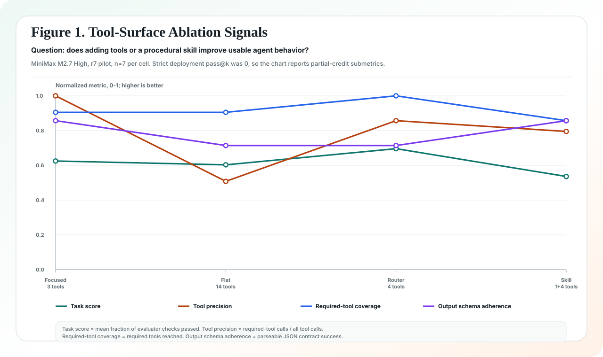
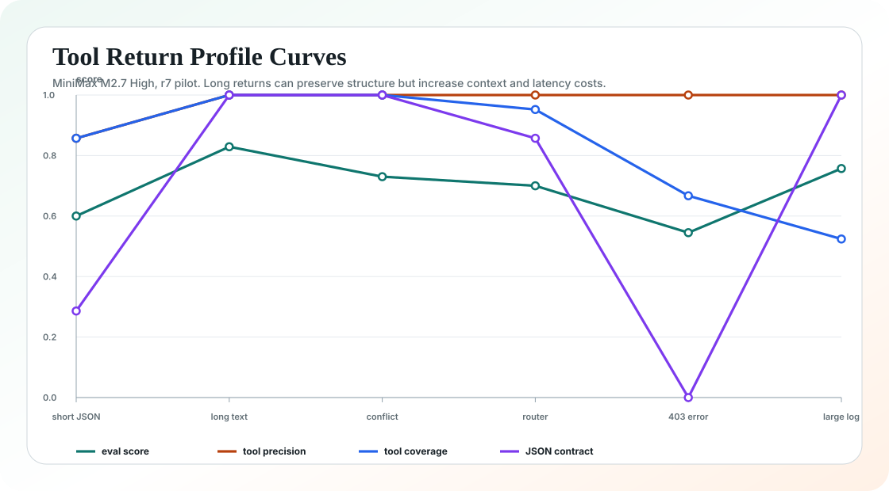
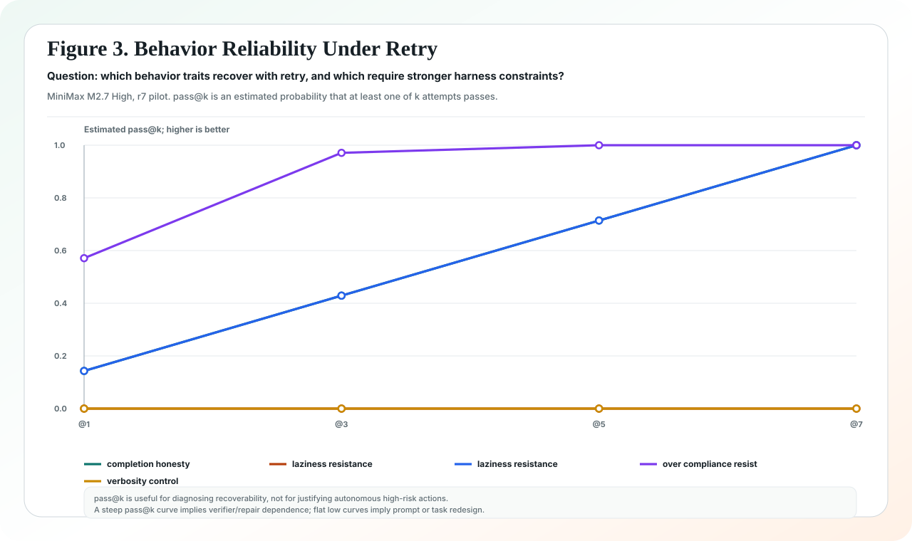

# Agent Peak Bench

<p align="center">
  <strong>Business-goal-driven, harness-first evaluation for real agent deployment.</strong>
</p>

<p align="center">
  <a href="https://2sao7sao.github.io/agent-peak-bench/"></a>
  <a href="./report/agent-peak-bench-integrated-report.zh-CN.md"></a>
  <a href="./evals/benchmark_manifest_v2.json"></a>
  
</p>

<p align="center">
  <a href="./README.zh-CN.md">中文</a>
  ·
  <a href="./report/business-goal-agent-benchmark-methodology.zh-CN.md">Business-goal methodology</a>
  ·
  <a href="./ROADMAP.md">Roadmap</a>
  ·
  <a href="./CONTRIBUTING.md">Contributing</a>
  ·
  <a href="./report/agent-peak-bench-integrated-report.zh-CN.md">Integrated report</a>
  ·
  <a href="https://2sao7sao.github.io/agent-peak-bench/">GitHub Pages</a>
</p>

## What This Is

Agent Peak Bench is not another model leaderboard. It is an evaluation system
for deciding **how a model should be deployed as an agent**.

The project starts from a user's business requirement, not from a predefined
AI feature list. It first asks whether AI should be used at all, then identifies
which parts can be delegated to an agent, which capabilities must be tested,
which risks require human control, and how model capabilities should be
combined with engineering mechanisms such as memory, RAG, MCP/tools, skills,
multi-agent topology, verifier loops, approval workflows, and harness design to
make the deployment reliable.

The output is not a single score. A serious run should produce four artifacts:

| Artifact | Question it answers |
| --- | --- |
| Model capability report | What can Model A do reliably across agent task families? |
| Business-goal report | How does Model A perform for a concrete commercial workflow? |
| Agent deployment cookbook | Should this use single-agent, multi-agent, memory, RAG, MCP routers, skills, verifier loops, or human approval? |
| Vendor feedback pack | Which reproducible failure clusters should a model provider optimize? |

> [!IMPORTANT]
> MiniMax M2.7 High is only the first case study. Agent Peak Bench is
> model-agnostic and uses generic `MODEL_*` provider variables. Historical
> `MINIMAX_*` aliases are retained only for compatibility.

## Why It Exists

Most benchmarks tell you whether a model can solve a task. Agent deployment
needs a more operational answer:

> Under which harness, tool, context, memory, skill, approval, and verifier
> conditions can this model safely move a business process forward?

That requires testing model behavior and system design together. A model that
fails with 14 flat tools may work with a router. A model with low pass@1 but
high pass@7 may be useful with verifier/repair loops, but unsafe for direct
autonomy. A model that drafts good content may still need a separate harness
engineer to verify product claims.

## Evaluation Stack


## Primary Suites

| Suite | Role | Evaluates |
| --- | --- | --- |
| [`business_goal_agent_synthesis_v1`](./evals/suites/business_goal_agent_synthesis_v1.json) | Business-goal layer | Turns commercial objectives into capability maps, benchmark plans, deployment cookbooks, and vendor feedback. |
| [`enterprise_agent_landing_v3`](./evals/suites/enterprise_agent_landing_v3.json) | End-to-end enterprise work | Implicit intent, enterprise evidence, cross-system tool use, governance, long-running resume. |
| [`tool_skill_mcp_ablation_v3`](./evals/suites/tool_skill_mcp_ablation_v3.json) | Engineering attribution | Focused tools vs flat overload vs router layering vs procedural skill contracts. |
| [`tool_return_profiles_v1`](./evals/suites/tool_return_profiles_v1.json) | Tool-result sensitivity | Short JSON, long noisy returns, conflicting evidence, permission errors, and large logs. |
| [`openclaw_complex_agent_tasks_v1`](./evals/suites/openclaw_complex_agent_tasks_v1.json) | Complex agent pressure | Personal OS, voice-triggered production fix, async GitHub, multi-agent ops, plugin governance, memory safety. |

Supporting probes cover context windows, tool counts, behavior/rigor,
repeatability, skill design, and harness load-bearing ablations.

## What Gets Measured

| Dimension | Metrics |
| --- | --- |
| Reliability | pass@1, pass@3, pass@5, pass@7, pass@10, CI95, output consistency. |
| Tool use | required-tool coverage, tool precision, forbidden tool calls, repeated calls. |
| Output contract | JSON/schema adherence, missing-evidence honesty, evidence placement. |
| Harness pressure | context length, generated context chars, plan mode, topology, tool surface. |
| Runtime | total latency, first-round latency, tool rounds, token usage. |
| Deployment risk | unsafe action, policy miss, single-source bias, schema drift, role blur. |

If pass@1 is weak but pass@k improves, the conclusion is not "the model is
ready"; it is "the model is harness-dependent."

## Current Case Study

The first MiniMax M2.7 High r7 pilot covered 4 suites, 19 scenarios, and 133
trials. It is a pilot signal, not a final boundary claim. Strong claims require
r30 calibration and, for high-risk deployment decisions, confirmatory r100
cells.







## Run It

Plan a campaign batch without calling a model:

```bash
python3 scripts/run_eval_campaign.py \
  evals/campaigns/harness_engineering_campaign_v1.json \
  --batch business_goal_mapping_pilot
```

Generate a business-goal suite skeleton:

```bash
python3 scripts/generate_business_goal_suite.py \
  evals/business_goals/security_review_acceleration.yaml \
  evals/business_goals/support_refund_automation.yaml \
  --out /tmp/business-goal-suite.json
```

Run one suite after setting provider credentials:

```bash
export MODEL_API_KEY="your_key"
export MODEL_NAME="target-model"
export MODEL_API_BASE="https://provider.example.com/anthropic/v1/messages"

python3 scripts/run_minimax_evals.py \
  --suite evals/suites/business_goal_agent_synthesis_v1.json \
  --pass-k 1,3,5,7,10 \
  --out results/model-business-goal-agent-synthesis-v1.json
```

Summarize multiple result files:

```bash
python3 scripts/summarize_eval_results.py \
  results/harness_engineering_campaign_v1/*.json \
  --json-out results/harness_engineering_campaign_v1/summary.json
```

Check suite distribution:

```bash
python3 scripts/check_benchmark_distribution.py
```

## Repository Map

| Path | Purpose |
| --- | --- |
| [`report/agent-peak-bench-integrated-report.zh-CN.md`](./report/agent-peak-bench-integrated-report.zh-CN.md) | Main integrated report and MiniMax case-study interpretation. |
| [`report/github-repo-product-review-2026-05-11.zh-CN.md`](./report/github-repo-product-review-2026-05-11.zh-CN.md) | Product review of Agent Peak Bench, EvolveKB, and EvolveMemory against current popular GitHub AI projects. |
| [`report/business-goal-agent-benchmark-methodology.zh-CN.md`](./report/business-goal-agent-benchmark-methodology.zh-CN.md) | Business-goal benchmark methodology. |
| [`ROADMAP.md`](./ROADMAP.md) | Product roadmap from OSS kit to multi-model evidence and production-like canaries. |
| [`CONTRIBUTING.md`](./CONTRIBUTING.md) | Contribution workflow and quality bar. |
| [`evals/suites/`](./evals/suites) | Evaluation suites. |
| [`evals/business_goals/`](./evals/business_goals) | Business-goal profiles used to turn commercial objectives into benchmark skeletons. |
| [`evals/campaigns/harness_engineering_campaign_v1.json`](./evals/campaigns/harness_engineering_campaign_v1.json) | Multi-day/multi-week campaign plan. |
| [`evals/blueprints/business_goal_benchmark_blueprint.md`](./evals/blueprints/business_goal_benchmark_blueprint.md) | Template for creating new business-goal suites. |
| [`research/benchmark_sources/source_index.json`](./research/benchmark_sources/source_index.json) | Public benchmark sources reviewed for methodology design. |
| [`docs/index.html`](./docs/index.html) | GitHub Pages landing report. |
| [`scripts/run_minimax_evals.py`](./scripts/run_minimax_evals.py) | Anthropic-compatible evaluator runner. Filename kept for historical compatibility. |
| [`scripts/run_eval_campaign.py`](./scripts/run_eval_campaign.py) | Campaign planner/executor. |
| [`scripts/generate_business_goal_suite.py`](./scripts/generate_business_goal_suite.py) | Converts business-goal YAML profiles into reviewable suite skeletons. |
| [`scripts/summarize_eval_results.py`](./scripts/summarize_eval_results.py) | Multi-result summarizer. |
| [`scripts/check_benchmark_distribution.py`](./scripts/check_benchmark_distribution.py) | Suite distribution checker. |

## Security

- Do not commit API keys, tokens, cookies, raw traces, or private tool outputs.
- `results/` is local-only and gitignored.
- Public releases should contain sanitized summaries, aggregate metrics, failure taxonomy, and engineering guidance only.
