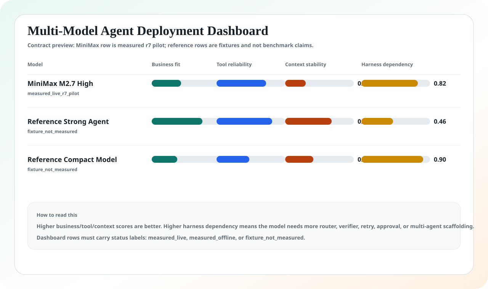
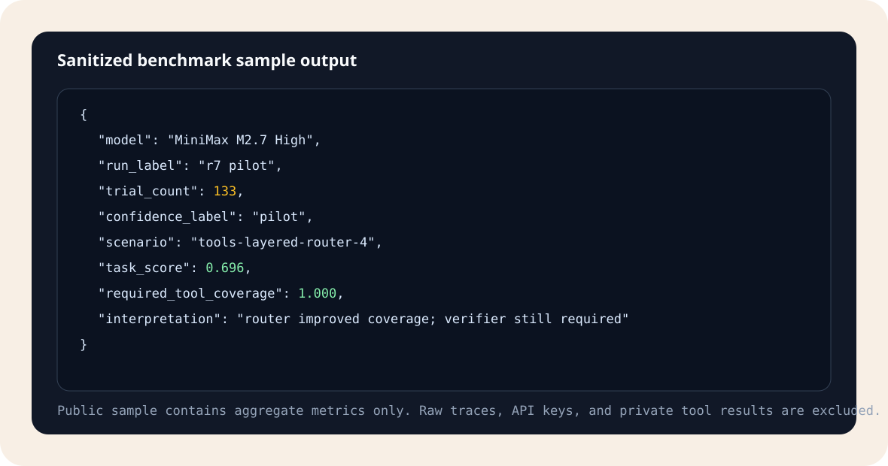

# Agent Peak Bench

<p align="center">
  <strong>把业务目标变成模型评测、失败归因和 Agent 落地方案。</strong>
</p>

<p align="center">
  <a href="./README.md">English</a>
  ·
  <a href="https://2sao7sao.github.io/agent-peak-bench/">在线页面</a>
  ·
  <a href="https://2sao7sao.github.io/agent-peak-bench/multi-model-dashboard.html">多模型 Dashboard</a>
  ·
  <a href="./report/agent-peak-bench-integrated-report.zh-CN.md">综合报告</a>
  ·
  <a href="./CONTRIBUTING.md">贡献指南</a>
</p>

<p align="center">
  
  
  
  
</p>

## 不要再问“哪个模型最强”

真正应该问的是：

> **哪个模型能在我的业务流程里推进任务？需要什么 harness？风险在哪里？工程上该怎么搭？**

Agent Peak Bench 不是普通 leaderboard。它是一个 harness-first 的评测工具包，
用于把商业化目标转成：

| 产物 | 回答什么 |
| --- | --- |
| 模型能力报告 | 模型在各类 Agent 任务中哪些能力稳定，哪些不稳定。 |
| 定向业务报告 | 它能不能处理续约风险、退款自动化、安全评审、财务关账等具体流程。 |
| Agent cookbook | 应该用 single-agent、multi-agent、memory、RAG、MCP router、skills、verifier 还是审批流。 |
| 厂商反馈包 | 哪些可复现失败簇应该反馈给模型厂商优化。 |



> [!IMPORTANT]
> MiniMax M2.7 High 是第一个实测 case study。Agent Peak Bench 本身是模型无关的。
> Dashboard 中未实测模型会明确标记为 fixture，不能当成真实 benchmark 结论。

## 30 秒理解

```text
Business goal -> Capability map -> Benchmark suite -> Repeated trials
-> Failure attribution -> Harness design -> Deployment cookbook -> Vendor feedback
```

多数 benchmark 告诉你模型有没有做对题。Agent 落地更需要知道模型能不能安全推进
一个业务流程。

| 常见 benchmark | Agent Peak Bench |
| --- | --- |
| 从任务集出发 | 从业务目标出发 |
| 输出一个分数 | 输出能力、风险、cookbook、厂商反馈 |
| 工具只是测试细节 | 专门测试工具面、router、side effect、审批 |
| 不关心 harness | 测 memory、RAG、skills、MCP、verifier、multi-agent、context strategy |
| 跑一次就下结论 | 支持 r7 pilot、r30 calibration、r100 confirmatory cells |

## 先跑业务目标流程

从 business profile 生成 suite skeleton：

```bash
git clone https://github.com/2sao7sao/agent-peak-bench.git
cd agent-peak-bench
python3 scripts/generate_business_goal_suite.py \
  evals/business_goals/security_review_acceleration.yaml \
  evals/business_goals/support_refund_automation.yaml \
  --out /tmp/business-goal-suite.json
```

只规划 campaign，不调用模型：

```bash
python3 scripts/run_eval_campaign.py \
  evals/campaigns/harness_engineering_campaign_v1.json \
  --batch business_goal_mapping_pilot
```

配置 Anthropic-compatible provider 后运行一个 suite：

```bash
export MODEL_API_KEY="your_key"
export MODEL_NAME="target-model"
export MODEL_API_BASE="https://provider.example.com/anthropic/v1/messages"

python3 scripts/run_minimax_evals.py \
  --suite evals/suites/business_goal_agent_synthesis_v1.json \
  --pass-k 1,3,5,7,10 \
  --out results/model-business-goal-agent-synthesis-v1.json
```

## 测什么

| 层 | 关键问题 |
| --- | --- |
| Business fit | 模型能不能从模糊业务语言恢复真实目标？ |
| Tool use | 能不能调用正确系统，并避开危险 side-effect tools？ |
| Context pressure | 长上下文、噪声上下文、模糊上下文下是否漂移？ |
| Skills and MCP | procedural skills、router、聚焦工具是否提升稳定性？ |
| Multi-agent design | planner / executor / verifier 什么时候优于单 Agent？ |
| Governance | 是否遵守权限、审批、缺失证据、审计要求？ |
| Reliability | pass@1/3/5/7/10、CI95、latency、consistency 如何变化？ |

## 主评测集

| Suite | 角色 |
| --- | --- |
| [`business_goal_agent_synthesis_v1`](./evals/suites/business_goal_agent_synthesis_v1.json) | 把商业目标转成能力项、benchmark plan、cookbook 和厂商反馈。 |
| [`enterprise_agent_landing_v3`](./evals/suites/enterprise_agent_landing_v3.json) | 企业端到端任务：潜台词、跨系统证据、治理、长任务恢复。 |
| [`tool_skill_mcp_ablation_v3`](./evals/suites/tool_skill_mcp_ablation_v3.json) | 聚焦工具、工具过载、router 分层、procedural skill 对比。 |
| [`tool_return_profiles_v1`](./evals/suites/tool_return_profiles_v1.json) | 短 JSON、长噪声、冲突证据、权限错误、大日志。 |
| [`openclaw_complex_agent_tasks_v1`](./evals/suites/openclaw_complex_agent_tasks_v1.json) | personal OS、语音生产修复、异步 GitHub、多 Agent 运营、插件治理、memory 安全。 |

## 当前证据

第一个公开实测案例是 **MiniMax M2.7 High r7 pilot**：

| 范围 | 数值 |
| --- | ---: |
| Suites | `4` |
| Scenarios | `19` |
| Trials | `133` |
| 置信标签 | `pilot` |

公开资产：

| 资产 | 作用 |
| --- | --- |
| [综合报告](./report/agent-peak-bench-integrated-report.zh-CN.md) | MiniMax case study 解读和方法论。 |
| [多模型 Dashboard](./docs/multi-model-dashboard.html) | 区分 measured / fixture 状态的 dashboard contract。 |
| [实测样例输出](./public/benchmark-samples/minimax-r7-sample-output.json) | 脱敏后的聚合 benchmark 样例。 |
| [Dashboard JSON contract](./public/multi-model-dashboard-sample.json) | 多模型对比 schema，避免 fixture 和实测混淆。 |



## 如何解释结果

| 信号 | 落地含义 |
| --- | --- |
| pass@1 低但 pass@k 高 | 模型可能适合 retry/verifier/repair loop，不适合直接自治。 |
| 平铺工具下 precision 下降 | 需要 router、聚焦工具面或角色拆分。 |
| 长上下文下 schema drift | 需要 context compression、output contract 或 multi-window handoff。 |
| 内容好但证据弱 | 拆 content engineer 和 harness verifier。 |
| 权限错误处理差 | 加 approval gate 和 completion-honesty check。 |

## 仓库结构

```text
evals/business_goals/     # 生成 suite skeleton 的业务 profile
evals/suites/             # benchmark suites
evals/campaigns/          # 多天/多周 campaign specs
scripts/                  # runner、campaign planner、summarizer、generator
docs/                     # GitHub Pages、dashboard、图表资产
public/                   # 脱敏样例结果和 dashboard contracts
report/                   # 综合报告、方法论、system card、分析
research/                 # benchmark 来源和 repo review 信号
```

## Roadmap

| 阶段 | 目标 |
| --- | --- |
| OSS kit | Profiles、suite generator、CI、Pages、sample outputs。 |
| Multi-model evidence | 多 provider 在同一业务目标上跑 r30 calibration。 |
| Cookbook engine | 生成 topology、harness、memory/RAG/MCP/skills/verifier 建议。 |
| Production-like canaries | 加入脱敏 live-adapter fixtures 和周期性回归 campaign。 |

## Security

不要提交 API key、provider secret、raw trace、客户数据、私有工具输出或线上系统导出。
公开版本只应包含脱敏 summary、聚合指标、failure taxonomy 和工程建议。

## License

MIT. See [LICENSE](LICENSE).
