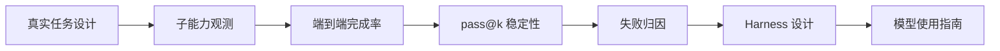

# Agent Peak Bench

<p align="center">
  <strong>面向 Agent 落地的 harness-first 模型评测：从真实任务、失败归因到工程设计和模型使用指南。</strong>
</p>

<p align="center">
  <a href="https://2sao7sao.github.io/agent-peak-bench/"></a>
  <a href="./report/agent-peak-bench-integrated-report.zh-CN.md"></a>
  <a href="./evals/benchmark_manifest_v2.json"></a>
  
</p>

<p align="center">
  <a href="./README.md">English</a>
  ·
  <a href="./report/agent-peak-bench-integrated-report.zh-CN.md">综合报告</a>
  ·
  <a href="./docs/evaluation-samples.zh-CN.md">评估样本</a>
  ·
  <a href="https://2sao7sao.github.io/agent-peak-bench/">在线页面</a>
</p>

## 项目定位

Agent Peak Bench 不做单一排行榜分数。它要回答的是：

> 一个模型在真实 Agent 场景里，什么时候能稳定完成任务，什么时候需要 harness、router、skills、MCP 分层、verifier 或人工审批才能安全落地？

本仓库的主入口是 [Agent Peak Bench 综合报告](./report/agent-peak-bench-integrated-report.zh-CN.md)。所有评估结论、方法论、OpenClaw 复杂任务方向、工具/skills/MCP 归因、MiniMax M2.7 High 使用指南，都统一收敛到这份报告中。

> [!IMPORTANT]
> 本轮只把 MiniMax M2.7 High 作为首个 case study。Agent Peak Bench 本身是模型无关 benchmark，不是面向 MiniMax 定制的评测。后续可以用同一套 suite、同一套指标，对任何 Anthropic-compatible API 模型或适配后的模型运行。

早期 smoke/canary 只用于验证评测 runner 和接口链路，不作为 README 的模型能力结论。

## MiniMax Live r7 Pilot

已完成 MiniMax M2.7 High live r7 pilot：4 组 suite、19 个场景、133 trials。r7 只是 pilot，不是最终强置信结论；r30 calibration 已启动，用于后续替换为更稳定的结论。

图中字段统一解释：`Task score` 是评估检查项部分得分，`Tool precision` 是工具调用精度，`Required-tool coverage` 是必要工具覆盖率，`Output schema adherence` 是输出结构契约通过率。它们是定位工程边界的子指标，不等同于最终 strict pass rate。


## 主评测集

| Suite | 目的 | 评估重点 |
| --- | --- | --- |
| [`enterprise_agent_landing_v3.json`](./evals/suites/enterprise_agent_landing_v3.json) | 企业级 Agent 端到端任务 | 潜台词理解、企业资料查询、多 MCP 工具调用、权限治理、复杂需求拆解、长任务恢复。 |
| [`tool_skill_mcp_ablation_v3.json`](./evals/suites/tool_skill_mcp_ablation_v3.json) | 工具/skills/MCP 工程归因 | 3 工具直连、14 工具平铺、router 分层、procedural skill 对稳定性的影响。 |
| [`tool_return_profiles_v1.json`](./evals/suites/tool_return_profiles_v1.json) | 工具返回 profile 归因 | 短 JSON、长噪声返回、冲突证据、router bundle、权限错误、大型日志 artifact。 |
| [`openclaw_complex_agent_tasks_v1.json`](./evals/suites/openclaw_complex_agent_tasks_v1.json) | OpenClaw 风格复杂任务 | personal OS、语音生产修复、异步 GitHub、多 Agent 运营、插件治理、长期记忆安全。 |

## 评估闭环



## 关键问题

| 问题 | 对应评测 |
| --- | --- |
| 模型能否理解用户潜台词，而不是只按显式指令答题？ | 企业安全评审、续约风险、业务分析场景。 |
| 最多可以挂多少工具才稳定？ | 3 工具直连 vs 14 工具平铺 vs router 分层 ablation。 |
| MCP / skills 如何设计更稳？ | `tool_skill_mcp_ablation_v3`。 |
| 复杂系统该如何拆解？ | 企业知识 Agent 架构、multi-agent handoff、OpenClaw personal OS。 |
| 长期运行和 memory 是否安全？ | OpenClaw persistent workspace memory / prompt injection 场景。 |
| pass@1 低但 pass@7 高时怎么办？ | 引入 retry、verifier、repair loop、权限 gate，而不是直接 autonomous execution。 |
| 模型上下文恐慌窗口在哪里？ | 跑 context window sweep，观察 pass rate、context chars、schema pass rate、latency。 |
| multi-agent 什么时候优于 single-agent？ | 按 `agent_topology` 和 `harness_mode` 切片比较 campaign 结果。 |
| 上下文模糊度是否改变最终结果？ | 跟踪 `ambiguity_profile` 和冲突证据场景。 |

## Long-Running Campaign

强边界结论不应来自一次 smoke run，而应来自持续数天到数周的 evaluation campaign。Campaign 规格见 [`evals/campaigns/harness_engineering_campaign_v1.json`](./evals/campaigns/harness_engineering_campaign_v1.json)。

只生成命令，不执行：

```bash
python3 scripts/run_eval_campaign.py \
  evals/campaigns/harness_engineering_campaign_v1.json \
  --batch pilot_boundary_scan
```

配置 provider 后执行 batch：

```bash
export MODEL_API_KEY="your_key"
export MODEL_NAME="MiniMax-M2.7-highspeed"
export MODEL_API_BASE="https://api.minimaxi.com/anthropic/v1/messages"

python3 scripts/run_eval_campaign.py \
  evals/campaigns/harness_engineering_campaign_v1.json \
  --batch pilot_boundary_scan \
  --execute
```

`MINIMAX_API_KEY`、`MINIMAX_MODEL`、`MINIMAX_API_BASE` 仍作为兼容别名保留，但新文档统一使用 `MODEL_*`，避免 benchmark 绑定单一模型。

合并多天或多批次结果：

```bash
python3 scripts/summarize_eval_results.py \
  results/harness_engineering_campaign_v1/*.json \
  --json-out results/harness_engineering_campaign_v1/summary.json
```

## 单 suite 运行

```bash
python3 scripts/run_minimax_evals.py \
  --suite evals/suites/enterprise_agent_landing_v3.json \
  --pass-k 1,3,5,7,10 \
  --out results/minimax-enterprise-agent-v3.json

python3 scripts/run_minimax_evals.py \
  --suite evals/suites/tool_skill_mcp_ablation_v3.json \
  --pass-k 1,3,5,7,10 \
  --out results/minimax-tool-skill-mcp-ablation-v3.json

python3 scripts/run_minimax_evals.py \
  --suite evals/suites/tool_return_profiles_v1.json \
  --pass-k 1,3,5,7,10 \
  --out results/minimax-tool-return-profiles-v1.json

python3 scripts/run_minimax_evals.py \
  --suite evals/suites/openclaw_complex_agent_tasks_v1.json \
  --pass-k 1,3,5,7,10 \
  --out results/minimax-openclaw-complex-v1.json
```

检查任务分布：

```bash
python3 scripts/check_benchmark_distribution.py
```

## 仓库结构

| 路径 | 作用 |
| --- | --- |
| [`report/agent-peak-bench-integrated-report.zh-CN.md`](./report/agent-peak-bench-integrated-report.zh-CN.md) | 唯一主综合报告。 |
| [`docs/evaluation-samples.zh-CN.md`](./docs/evaluation-samples.zh-CN.md) | 真实样本与判分逻辑示例。 |
| [`docs/assets/campaign-observability.svg`](./docs/assets/campaign-observability.svg) | Campaign 实验维度到观测指标的矩阵。 |
| [`docs/assets/tool-eval-matrix.svg`](./docs/assets/tool-eval-matrix.svg) | 工具返回 profile 评估矩阵。 |
| [`public/minimax-m27-high-r7-aggregate-summary.json`](./public/minimax-m27-high-r7-aggregate-summary.json) | 脱敏 r7 live pilot 聚合结果。 |
| [`evals/campaigns/harness_engineering_campaign_v1.json`](./evals/campaigns/harness_engineering_campaign_v1.json) | 数天到数周的 harness engineering campaign 规格。 |
| [`evals/model_config.example.json`](./evals/model_config.example.json) | 模型无关 provider 配置示例，不包含真实 key。 |
| [`evals/suites/`](./evals/suites) | 评测 suite。 |
| [`scripts/run_minimax_evals.py`](./scripts/run_minimax_evals.py) | Anthropic-compatible API 评测执行器，保留旧文件名以避免破坏历史链接。 |
| [`scripts/run_eval_campaign.py`](./scripts/run_eval_campaign.py) | 规划或执行 campaign batch。 |
| [`scripts/summarize_eval_results.py`](./scripts/summarize_eval_results.py) | 结果摘要脚本。 |
| [`scripts/check_benchmark_distribution.py`](./scripts/check_benchmark_distribution.py) | 任务分布检查。 |

## 安全边界

- 不要把 API key 写入 README、suite、结果文件或命令历史。
- `results/` 是本地结果目录，已被 gitignore。
- 对外只发布脱敏 summary、聚合指标、failure taxonomy 和工程建议。
- 原始工具返回、私有 trace、凭证、token、cookie 不应发布。
