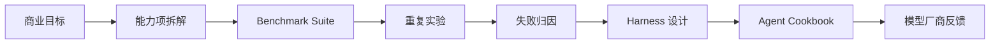

# Agent Peak Bench

<p align="center">
  <strong>面向真实 Agent 落地的商业目标驱动、harness-first 模型评测系统。</strong>
</p>

<p align="center">
  <a href="https://2sao7sao.github.io/agent-peak-bench/"></a>
  <a href="./report/agent-peak-bench-integrated-report.zh-CN.md"></a>
  <a href="./evals/benchmark_manifest_v2.json"></a>
  
</p>

<p align="center">
  <a href="./README.md">English</a>
  ·
  <a href="./report/business-goal-agent-benchmark-methodology.zh-CN.md">商业目标方法论</a>
  ·
  <a href="./report/agent-peak-bench-integrated-report.zh-CN.md">综合报告</a>
  ·
  <a href="https://2sao7sao.github.io/agent-peak-bench/">在线页面</a>
</p>

## 这是什么

Agent Peak Bench 不是一个只给模型排名的榜单。它是一个用来回答
**模型应该如何被搭成 Agent 并进入业务场景** 的评估系统。

项目从用户的业务需求出发，而不是从预设 AI 功能清单出发。它先判断这个需求
是否适合 AI 落地，再拆解哪些环节可以交给 Agent、需要测试哪些模型能力、
哪些风险必须保留人工控制，并进一步判断如何组合模型能力与工程手段完成落地：
例如 memory、RAG、MCP/tools、skills、multi-agent 拓扑、verifier、审批流和
harness 设计。

一次严肃评测不应该只输出一个分数，而应该输出四类产物：

| 产物 | 回答的问题 |
| --- | --- |
| 模型综合能力报告 | 模型 A 在各类 agent 任务里哪些能力稳定，哪些能力不稳定。 |
| 定向业务表现报告 | 模型 A 在某个具体商业流程里是否可用，风险在哪里。 |
| Agent 落地 cookbook | 该用 single-agent、multi-agent、memory、RAG、MCP router、skills、verifier 还是人工审批。 |
| 模型厂商反馈包 | 哪些可复现失败簇应该反馈给模型厂商优化。 |

> [!IMPORTANT]
> MiniMax M2.7 High 只是第一个 case study。Agent Peak Bench 是模型无关评测体系，默认使用通用 `MODEL_*` 环境变量。历史 `MINIMAX_*` 变量只作为兼容别名保留。

## 为什么需要它

多数 benchmark 告诉你“模型能不能做一道题”。真实 Agent 落地要回答的是：

> 在什么 harness、工具、上下文、memory、skills、审批和 verifier 条件下，这个模型才能安全推进一个业务流程？

这要求同时测试模型能力和工程设计。一个模型在 14 个平铺工具下会乱调，但在
router 分层后可能稳定；一个模型 pass@1 低但 pass@7 高，说明它有潜力但依赖
verifier / repair loop，不能直接放权；一个模型能写出好文案，也可能需要独立
harness engineer 去校验证据和产品 claim。

## 评估闭环



## 主评测集

| Suite | 角色 | 评估内容 |
| --- | --- | --- |
| [`business_goal_agent_synthesis_v1`](./evals/suites/business_goal_agent_synthesis_v1.json) | 商业目标层 | 把商业目标转成能力项、benchmark plan、agent cookbook 和 vendor feedback。 |
| [`enterprise_agent_landing_v3`](./evals/suites/enterprise_agent_landing_v3.json) | 企业端到端任务 | 潜台词理解、企业证据检索、跨系统工具调用、权限治理、长任务恢复。 |
| [`tool_skill_mcp_ablation_v3`](./evals/suites/tool_skill_mcp_ablation_v3.json) | 工程归因 | 聚焦工具、平铺工具、router 分层、procedural skill contract 的差异。 |
| [`tool_return_profiles_v1`](./evals/suites/tool_return_profiles_v1.json) | 工具返回敏感性 | 短 JSON、长噪声、冲突证据、权限错误、大型日志对模型的影响。 |
| [`openclaw_complex_agent_tasks_v1`](./evals/suites/openclaw_complex_agent_tasks_v1.json) | 复杂 Agent 压力 | personal OS、语音生产修复、异步 GitHub、多 Agent 运营、插件治理、memory 安全。 |

辅助 probes 覆盖上下文窗口、工具数量、行为严谨性、repeatability、skill 设计和
harness load-bearing ablation。

## 观测指标

| 维度 | 指标 |
| --- | --- |
| 稳定性 | pass@1、pass@3、pass@5、pass@7、pass@10、CI95、输出一致性。 |
| 工具使用 | required-tool coverage、tool precision、forbidden tool calls、重复调用。 |
| 输出契约 | JSON/schema 通过率、缺口诚实、证据字段位置。 |
| Harness 压力 | context length、generated context chars、plan mode、agent topology、tool surface。 |
| 运行成本 | total latency、first-round latency、tool rounds、token usage。 |
| 落地风险 | unsafe action、policy miss、single-source bias、schema drift、role blur。 |

如果 pass@1 低但 pass@k 高，结论不是“模型已经可生产”，而是“模型依赖 harness”。

## 当前 Case Study

MiniMax M2.7 High 第一轮 r7 pilot 覆盖 4 个 suite、19 个场景、133 trials。r7 是
pilot 信号，不是强边界结论。严肃结论需要 r30 calibration；高风险部署决策需要
r100 confirmatory cells。


## 运行方式

只规划 batch，不调用模型：

```bash
python3 scripts/run_eval_campaign.py \
  evals/campaigns/harness_engineering_campaign_v1.json \
  --batch business_goal_mapping_pilot
```

配置 provider 后运行单 suite：

```bash
export MODEL_API_KEY="your_key"
export MODEL_NAME="target-model"
export MODEL_API_BASE="https://provider.example.com/anthropic/v1/messages"

python3 scripts/run_minimax_evals.py \
  --suite evals/suites/business_goal_agent_synthesis_v1.json \
  --pass-k 1,3,5,7,10 \
  --out results/model-business-goal-agent-synthesis-v1.json
```

合并多批结果：

```bash
python3 scripts/summarize_eval_results.py \
  results/harness_engineering_campaign_v1/*.json \
  --json-out results/harness_engineering_campaign_v1/summary.json
```

检查 suite 分布：

```bash
python3 scripts/check_benchmark_distribution.py
```

## 仓库结构

| 路径 | 作用 |
| --- | --- |
| [`report/agent-peak-bench-integrated-report.zh-CN.md`](./report/agent-peak-bench-integrated-report.zh-CN.md) | 主综合报告和 MiniMax case study 解读。 |
| [`report/business-goal-agent-benchmark-methodology.zh-CN.md`](./report/business-goal-agent-benchmark-methodology.zh-CN.md) | 商业目标 benchmark 方法论。 |
| [`evals/suites/`](./evals/suites) | 评测 suite。 |
| [`evals/campaigns/harness_engineering_campaign_v1.json`](./evals/campaigns/harness_engineering_campaign_v1.json) | 多天到数周的 campaign 规格。 |
| [`evals/blueprints/business_goal_benchmark_blueprint.md`](./evals/blueprints/business_goal_benchmark_blueprint.md) | 新业务目标 suite 的创建模板。 |
| [`research/benchmark_sources/source_index.json`](./research/benchmark_sources/source_index.json) | 本轮参考的公开 benchmark 资料索引。 |
| [`docs/index.html`](./docs/index.html) | GitHub Pages 首页。 |
| [`scripts/run_minimax_evals.py`](./scripts/run_minimax_evals.py) | Anthropic-compatible 评测 runner，文件名保留历史兼容。 |
| [`scripts/run_eval_campaign.py`](./scripts/run_eval_campaign.py) | campaign 规划/执行脚本。 |
| [`scripts/summarize_eval_results.py`](./scripts/summarize_eval_results.py) | 多结果汇总脚本。 |
| [`scripts/check_benchmark_distribution.py`](./scripts/check_benchmark_distribution.py) | suite 分布检查脚本。 |

## 安全边界

- 不要提交 API key、token、cookie、原始 trace 或私有工具输出。
- `results/` 是本地目录，已被 gitignore。
- 对外只发布脱敏 summary、聚合指标、failure taxonomy 和工程建议。
