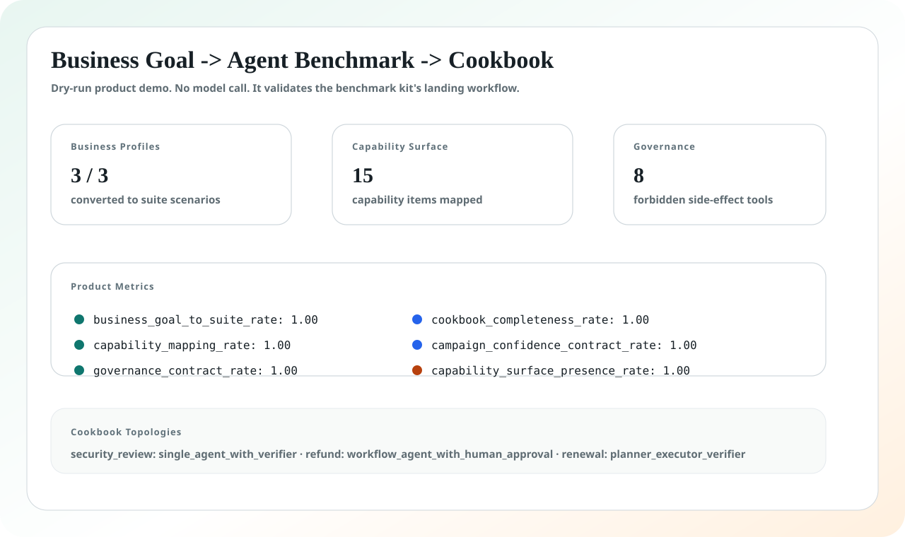

# Agent Peak Bench

<p align="center">
  <strong>把业务目标变成模型能力评测、失败归因和 Agent 落地 cookbook。</strong>
</p>

<p align="center">
  <a href="./README.md">English</a>
  ·
  <a href="https://2sao7sao.github.io/agent-peak-bench/">在线页面</a>
  ·
  <a href="https://2sao7sao.github.io/agent-peak-bench/multi-model-dashboard.html">多模型 Dashboard</a>
  ·
  <a href="./public/benchmark-samples/agent-peak-product-demo-output.json">Product Demo Output</a>
  ·
  <a href="./CONTRIBUTING.md">贡献指南</a>
</p>

<p align="center">
  
  
  
  
</p>

## 不要再问“哪个模型最强”

更应该问的是：

> **给定这个业务流程，哪些模型能力边界真正影响落地？需要什么 harness？最终 Agent 架构应该怎么搭？**

Agent Peak Bench 是一个 harness-first 的评测工具包。它从安全评审加速、退款自动化、
续约风险判断、财务关账等商业目标出发，反向生成能力评测、重复实验 campaign、
失败归因、模型厂商反馈和 Agent 落地 cookbook。



> [!IMPORTANT]
> MiniMax M2.7 High 是第一个实测 case study。Agent Peak Bench 本身是模型无关的。
> Dashboard 中未实测模型会明确标记为 fixture，不能当成真实 benchmark 结论。

## 30 秒产品路径

```text
Business goal
  -> capability map
  -> benchmark suite
  -> repeated trials
  -> failure attribution
  -> harness design
  -> deployment cookbook
  -> model-vendor feedback
```

| 如果你有... | Agent Peak Bench 产出... |
| --- | --- |
| 一个模糊业务想法 | 需要测试的模型能力和评测范围 |
| 一个目标工作流 | 带工具、审批、输出契约和失败分类的 suite skeleton |
| 一个候选模型 | pass@k、CI95、工具精度、schema adherence、latency、consistency |
| 一个上线决策 | single-agent / multi-agent / memory / RAG / MCP / skills / verifier / approval 建议 |
| 一次模型厂商反馈 | 可复现失败簇和模型优化方向 |

## 5 分钟产品 Demo

运行 dry-run 产品链路。它不会调用模型，也不需要 provider secret。

```bash
git clone https://github.com/2sao7sao/agent-peak-bench.git
cd agent-peak-bench
python3 -m pip install pyyaml
python3 scripts/run_product_demo.py
```

输出形态如下：

```text
# Agent Peak Bench Product Demo

status: PASS
business_profiles: 3
generated_scenarios: 3
capability_items: 15
required_tools: 13
forbidden_side_effect_tools: 8

## Product metrics
- business_goal_to_suite_rate: 1.00 (3/3)
- capability_mapping_rate: 1.00 (3/3)
- governance_contract_rate: 1.00 (3/3)
- cookbook_completeness_rate: 1.00 (3/3)
- campaign_confidence_contract_rate: 1.00 (1/1)
```

机器可读样例见
[`public/benchmark-samples/agent-peak-product-demo-output.json`](./public/benchmark-samples/agent-peak-product-demo-output.json)。

## Demo 证明了什么

这个 demo 验证的是项目工作流本身，不是模型分数。

| 指标 | 检查什么 | 为什么重要 |
| --- | --- | --- |
| `business_goal_to_suite_rate` | business profiles 是否能变成 benchmark scenarios | 评测必须从用户业务目标出发 |
| `capability_mapping_rate` | scenarios 是否包含能力项、benchmark mappings 和输出契约 | 结果可以追溯到落地能力要求 |
| `governance_contract_rate` | side-effect action 是否在无审批时被建模为 forbidden | Agent 评测必须测试权限和安全边界 |
| `cookbook_completeness_rate` | profiles 是否包含 topology、memory、RAG、tools、skills、verifier | 分数必须转成工程方案 |
| `campaign_confidence_contract_rate` | campaign 是否定义 r7/r30/r100 和 pass@k | 能力边界结论不能来自单次运行 |
| `capability_surface_presence_rate` | required tools、forbidden tools、decision objectives 是否可见 | harness design 不是附属文案，而是一等公民 |

## 运行核心流程

从 business profile 生成 suite skeleton：

```bash
python3 scripts/generate_business_goal_suite.py \
  evals/business_goals/security_review_acceleration.yaml \
  evals/business_goals/support_refund_automation.yaml \
  evals/business_goals/renewal_risk_diagnosis.yaml \
  --out /tmp/business-goal-suite.json
```

只规划 campaign，不调用模型：

```bash
python3 scripts/run_eval_campaign.py \
  evals/campaigns/harness_engineering_campaign_v1.json \
  --batch business_goal_mapping_pilot
```

配置 Anthropic-compatible provider 后运行一个 suite：

```bash
export MODEL_API_KEY="your_key"
export MODEL_NAME="target-model"
export MODEL_API_BASE="https://provider.example.com/anthropic/v1/messages"

python3 scripts/run_minimax_evals.py \
  --suite evals/suites/business_goal_agent_synthesis_v1.json \
  --pass-k 1,3,5,7,10 \
  --out results/model-business-goal-agent-synthesis-v1.json
```

## 测什么

| 层 | 关键落地问题 |
| --- | --- |
| Business fit | 模型能不能从模糊业务语言中恢复真实目标？ |
| Tool use | 能不能调用正确系统，并避开危险 side-effect tools？ |
| Context pressure | 长上下文、噪声上下文、模糊上下文下在哪里开始漂移？ |
| Skills and MCP | procedural skills、router、聚焦工具是否提升稳定性？ |
| Multi-agent design | planner / executor / verifier 什么时候优于单 Agent？ |
| Governance | 是否遵守权限、审批、缺失证据和审计要求？ |
| Reliability | pass@1/3/5/7/10、CI95、latency、consistency 如何变化？ |

## 主评测集

| Suite | 角色 |
| --- | --- |
| [`business_goal_agent_synthesis_v1`](./evals/suites/business_goal_agent_synthesis_v1.json) | 把商业目标转成能力项、benchmark plan、cookbook 和厂商反馈。 |
| [`enterprise_agent_landing_v3`](./evals/suites/enterprise_agent_landing_v3.json) | 企业端到端任务：潜台词、跨系统证据、治理、长任务恢复。 |
| [`tool_skill_mcp_ablation_v3`](./evals/suites/tool_skill_mcp_ablation_v3.json) | 聚焦工具、工具过载、router 分层、procedural skill 对比。 |
| [`tool_return_profiles_v1`](./evals/suites/tool_return_profiles_v1.json) | 短 JSON、长噪声、冲突证据、权限错误、大日志。 |
| [`openclaw_complex_agent_tasks_v1`](./evals/suites/openclaw_complex_agent_tasks_v1.json) | personal OS、语音生产修复、异步 GitHub、多 Agent 运营、插件治理、memory 安全。 |

## 当前证据

第一个公开实测案例是 **MiniMax M2.7 High r7 pilot**：

| 范围 | 数值 |
| --- | ---: |
| Suites | `4` |
| Scenarios | `19` |
| Trials | `133` |
| 置信标签 | `pilot` |

公开资产：

| 资产 | 作用 |
| --- | --- |
| [综合报告](./report/agent-peak-bench-integrated-report.zh-CN.md) | MiniMax case study 解读和方法论。 |
| [多模型 Dashboard](./docs/multi-model-dashboard.html) | 区分 measured / fixture 状态的 dashboard contract。 |
| [实测样例输出](./public/benchmark-samples/minimax-r7-sample-output.json) | 脱敏后的聚合 benchmark 样例。 |
| [Product demo output](./public/benchmark-samples/agent-peak-product-demo-output.json) | 确定性的项目工作流样例。 |


## 稳定能力与原型边界

| 层 | 当前状态 |
| --- | --- |
| Business-goal profiles 和 suite generator | 当前支持的项目路径 |
| Campaign planner 和 summarizer | 支持 dry-run planning 和结果聚合 |
| Provider runner | 支持 Anthropic-compatible APIs，需要用户凭据 |
| MiniMax report | pilot case study，不是最终 leaderboard |
| Multi-model dashboard | contract 和 sample UI，未实测行是 fixtures |
| 强落地边界结论 | 需要 r30/r100 cells、CI95 和稳定 failure taxonomy |

## 仓库结构

```text
evals/business_goals/     生成 suite skeleton 的业务 profiles
evals/suites/             benchmark suites
evals/campaigns/          多天/多周 campaign specs
scripts/                  product demo、runner、campaign planner、summarizer、generator
docs/                     GitHub Pages、dashboard、图表资产
public/                   脱敏结果样例和 dashboard contracts
report/                   综合报告、方法论、system card、分析
```

## Security

不要提交 API key、provider secret、raw trace、客户数据、私有工具输出或线上系统导出。
公开版本只应包含脱敏 summary、聚合指标、failure taxonomy 和工程建议。

## License

MIT. See [LICENSE](LICENSE).
