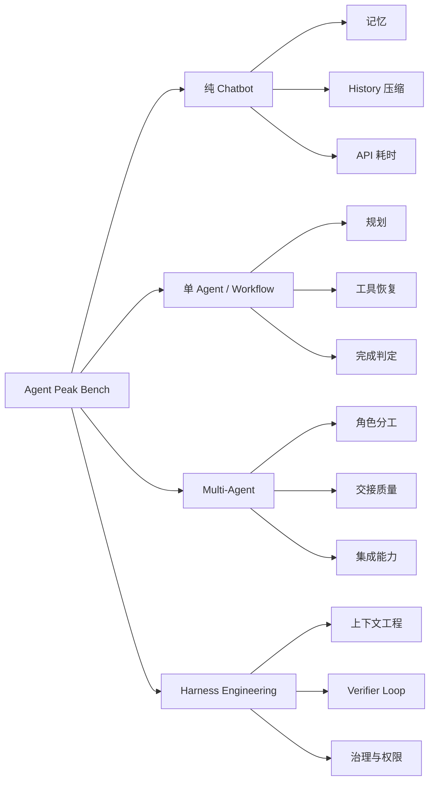

# Agent Peak Bench

<p align="center">
  <strong>面向 Agent 落地的 harness-first 模型评测：不只回答“模型强不强”，而是回答“在什么工程条件下模型最稳定、最可用”。</strong>
</p>

<p align="center">
  <a href="https://2sao7sao.github.io/agent-peak-bench/"></a>
  <a href="./public/minimax-m27-high-summary.json"></a>
  <a href="./evals/benchmark_manifest_v2.json"></a>
  
</p>

<p align="center">
  <a href="./README.md">English</a>
  ·
  <a href="https://2sao7sao.github.io/agent-peak-bench/">在线报告</a>
  ·
  <a href="./docs/evaluation-samples.zh-CN.md">评估样本示例</a>
  ·
  <a href="./report/enterprise-agent-benchmark-methodology.zh-CN.md">企业级方法论</a>
  ·
  <a href="./report/openclaw-usecase-benchmark-direction.zh-CN.md">OpenClaw 复杂任务方向</a>
  ·
  <a href="./report/minimax-agent-usage-handbook.md">模型使用指南</a>
</p>

## 摘要

传统 benchmark 往往把模型能力压缩成一个总分，这对横向排名有帮助，但对真实业务落地不足。Agent 系统的失败通常来自更具体的工程问题：上下文污染、工具面过载、状态漂移、skills 不可执行、验证链路缺失、长任务中途失控，以及模型对“已完成”的过度自信。

**Agent Peak Bench** 的目标是从系统视角评估模型：通过多轮重复、pass@k、skills/tool/context ablation、多 Agent 协作、harness 设计检查等方式，判断模型在什么条件下能够保持“尖峰时刻”，以及什么时候必须依赖外部工程约束。

首个公开案例是 **MiniMax M2.7 High**，实际模型名为 `MiniMax-M2.7-highspeed`。早期的 `minimax_canary_v1` 只保留为 smoke test；真正面向落地的主评测已经升级到 `enterprise_agent_landing_v3` 和 `tool_skill_mcp_ablation_v3`。

## v3 方向：企业级 Agent 落地评测

新评测不再把“记住某个字段”当作主能力，而是围绕真实企业 Agent 的端到端任务设计：

| 评测集 | 目的 | 看什么 |
| --- | --- | --- |
| [`enterprise_agent_landing_v3.json`](./evals/suites/enterprise_agent_landing_v3.json) | 真实企业 Agent 场景 | 潜台词理解、多 MCP 工具调用、证据综合、权限治理、复杂需求拆解、长任务恢复。 |
| [`tool_skill_mcp_ablation_v3.json`](./evals/suites/tool_skill_mcp_ablation_v3.json) | 工程机制归因 | 3 工具直连、14 工具平铺、router 分层、skill contract 对稳定性的影响。 |
| [`openclaw_complex_agent_tasks_v1.json`](./evals/suites/openclaw_complex_agent_tasks_v1.json) | OpenClaw 风格复杂任务 | personal OS、语音生产修复、异步 GitHub、multi-agent ops、skill/plugin governance、persistent memory security。 |
| [`enterprise-agent-benchmark-methodology.zh-CN.md`](./report/enterprise-agent-benchmark-methodology.zh-CN.md) | 一体化方法论 | 从评估到失败归因，再到 harness 设计和模型使用指南。 |
| [`openclaw-usecase-benchmark-direction.zh-CN.md`](./report/openclaw-usecase-benchmark-direction.zh-CN.md) | OpenClaw 使用场景调研 | 把公开 OpenClaw 用法转化为复杂 agent 评测方向。 |

v3 的结论形式不是“模型得了多少分”，而是：

| 输出 | 作用 |
| --- | --- |
| 子能力矩阵 | 判断模型是否能推断潜台词、选工具、识别权限、引用证据。 |
| 端到端完成率 | 判断一个真实业务流程能否被推进。 |
| pass@k 稳定性 | 判断模型是“一次可用”还是“需要 retry/verifier 才可用”。 |
| failure taxonomy | 失败归因到模型、工具、上下文、权限、schema 或 harness。 |
| 工程设计建议 | 反推工具数量、MCP 分层、skills 写法、context 策略和 verifier 机制。 |

## 当前结果快照

| 模型案例 | 日期 | Suite | 场景数 | Trial 数 | pass@1 | pass@3 | 解读 |
| --- | --- | --- | ---: | ---: | ---: | ---: | --- |
| MiniMax M2.7 High | 2026-05-06 | `minimax_canary_v1` | 8 | 24 | 25% | 50% | 短上下文结构化记忆很强；长噪声历史、严格 workflow、skill-only 控制较不稳定。 |

<p align="center">
  
</p>

> [!NOTE]
> 目前只报告 `pass@1/pass@3`，因为初始 canary 每个场景只有 3 次重复。`pass@5/pass@7` 需要每个场景至少 5/7 次 trial，否则会退化成 `pass@3`，属于伪指标。评测脚本已更新：样本不足时不再输出误导性的 pass@k，并提供 `--force-repeat 7` 用于重新测试。

> [!IMPORTANT]
> 上表是旧 canary 的初始结果，只能代表早期 smoke 质量，不代表 v3 企业级 Agent 落地能力。下一轮应以 `enterprise_agent_landing_v3` 为主评测。

## 为什么 pass@1 只有 25%，pass@3 达到 50%

`pass@1` 表示每个场景第一次尝试是否通过，更接近真实交互里的“一次成功率”。`pass@3` 表示同一场景重复 3 次后，只要任意一次通过就计为该场景可恢复。

因此，`pass@1=25%` 且 `pass@3=50%` 的含义不是“模型稳定变强”，而是：

| 观察 | 工程含义 |
| --- | --- |
| 第一次尝试成功率低 | 直接把模型接到业务流程上风险较高。 |
| 三次内有更多场景能通过 | 模型具备一定可恢复性，适合放在 retry / verifier / repair loop 里。 |
| pass@3 与 pass@1 差距较大 | 输出稳定性不足，需要 schema、状态机、工具约束和验收器。 |
| pass@5/pass@7 尚未有效测量 | 需要 `repeat >= 7` 的新实验，不能用 3 次 trial 推断。 |

## 维度评分

| 维度 | 分数 | 评估结论 | 使用建议 |
| --- | ---: | --- | --- |
| 短结构化记忆 | 95 | 多次重复稳定通过。 | 适合短 chatbot 状态、偏好记忆、结构化 memory extraction。 |
| 工具错误诚实度 | 50 | 能识别部分工具失败，但仍可能过度声称解决。 | 必须要求工具状态字段，并由 verifier 检查。 |
| 结构化拆解 | 50 | 分阶段任务可产出较好结果，但一致性有限。 | 用 planner/generator/evaluator，而不是一次性长 prompt。 |
| Harness 适配度 | 42 | 需要外部 contract、测试和状态管理。 | 把模型当作受控 worker，而不是完整 autonomous system。 |
| Grounded workflow | 35 | 推理看似合理，但严格 JSON 与工具顺序不稳定。 | 加 schema validation、retry、状态机。 |
| Skill 遵循 | 35 | skill 风格能改善格式，但不能保证完整执行。 | skills 要窄、可执行、可测试，避免泛人格设定。 |
| 上下文窗口稳定性 | 30 | compact context 可恢复，expanded noisy context 明显退化。 | 使用压缩、检索、handoff，不要倾倒全量历史。 |
| 长噪声历史 | 20 | 初始 canary 下失败明显。 | 使用 memory extraction + reset window，不依赖原始长历史。 |

## Benchmark 设计原则

本项目参考现代 benchmark 的表达方式：能力 taxonomy、任务分布、评测协议、指标矩阵、细粒度结果和误差分析。区别在于，本项目更关注 Agent 时代的工程落地，而不是单一排行榜分数。



### 任务族分布

| 任务族 | 权重 | 测试内容 |
| --- | ---: | --- |
| `chat_memory` | 10% | 多轮偏好记忆、memory extraction、history compression。 |
| `structured_workflow` | 15% | 证据收集、状态更新、流程完成、grounded decision。 |
| `tool_recovery` | 15% | 工具选择、工具失败处理、retry、fallback、抗幻觉。 |
| `coding_cli_repo` | 15% | 仓库理解、文件修改、测试执行、可执行验证。 |
| `long_running_harness` | 15% | planner/generator/evaluator、sprint contract、resume、verifier feedback。 |
| `context_engineering` | 10% | context map、压缩、reset window、长上下文压力。 |
| `multi_agent_coordination` | 10% | 角色拆分、handoff、冲突解决、集成计划。 |
| `system_governance` | 10% | 权限、sandbox、hooks、审计、observability、policy constraint。 |

## MiniMax M2.7 High 使用指南

| 场景 | 适配度 | 推荐方式 |
| --- | --- | --- |
| 短记忆 chatbot | 高 | 结构化 memory slot + compact history + 固定输出 schema。 |
| 有明确 rubric 的内容生成 | 中高 | 给 outline、验收标准、自检清单。 |
| 简单 workflow agent | 中 | 状态机 + 小工具面 + schema 失败自动重试。 |
| Content Engineer + Harness Engineer | 中 | 强制输出 handoff artifact，避免角色边界模糊。 |
| 长历史企业会话 | 低，除非有 harness | 先摘要、检索、重置窗口，不直接塞全量 history。 |
| 工具很多的 autonomous agent | 低，除非有 router | 使用工具路由、权限门禁、verifier loop。 |
| 合规关键自动化 | 不适合单独使用 | 必须有外部策略校验、审计日志和人工批准。 |

## pass@5 / pass@7 复测方式

当前仓库已支持有效复测。主评测建议直接运行 v3：

```bash
export MINIMAX_API_KEY="your_key"
export MINIMAX_MODEL="MiniMax-M2.7-highspeed"
export MINIMAX_API_BASE="https://api.minimaxi.com/anthropic/v1/messages"

python3 scripts/run_minimax_evals.py \
  --suite evals/suites/enterprise_agent_landing_v3.json \
  --pass-k 1,3,5,7 \
  --out results/minimax-enterprise-agent-v3.json

python3 scripts/run_minimax_evals.py \
  --suite evals/suites/tool_skill_mcp_ablation_v3.json \
  --pass-k 1,3,5,7 \
  --out results/minimax-tool-skill-mcp-ablation-v3.json

python3 scripts/run_minimax_evals.py \
  --suite evals/suites/openclaw_complex_agent_tasks_v1.json \
  --pass-k 1,3,5,7 \
  --out results/minimax-openclaw-complex-v1.json
```

如果只是复测旧 canary：

```bash
export MINIMAX_API_KEY="your_key"
export MINIMAX_MODEL="MiniMax-M2.7-highspeed"
export MINIMAX_API_BASE="https://api.minimaxi.com/anthropic/v1/messages"

python3 scripts/run_minimax_evals.py \
  --suite evals/suites/minimax_canary_v1.json \
  --force-repeat 7 \
  --pass-k 1,3,5,7 \
  --out results/minimax-canary-v1-repeat7.json
```

如果当前 shell 没有 `MINIMAX_API_KEY`，脚本会拒绝运行。不要把真实 key 写进 README、suite、结果文件或命令历史；建议只通过当前终端环境变量注入。结果文件默认在 `results/` 下，并且不会被 git 发布。

## 仓库结构

| 路径 | 作用 |
| --- | --- |
| [`README.md`](./README.md) | 英文报告首页。 |
| [`README.zh-CN.md`](./README.zh-CN.md) | 中文报告首页。 |
| [`docs/index.html`](./docs/index.html) | GitHub Pages 在线报告。 |
| [`docs/evaluation-samples.zh-CN.md`](./docs/evaluation-samples.zh-CN.md) | 具体评估样本和判分逻辑示例。 |
| [`report/enterprise-agent-benchmark-methodology.zh-CN.md`](./report/enterprise-agent-benchmark-methodology.zh-CN.md) | 企业级 Agent benchmark 一体化方法论。 |
| [`report/openclaw-usecase-benchmark-direction.zh-CN.md`](./report/openclaw-usecase-benchmark-direction.zh-CN.md) | OpenClaw 使用场景调研与复杂任务评测方向。 |
| [`public/minimax-m27-high-summary.json`](./public/minimax-m27-high-summary.json) | 脱敏公开结果摘要。 |
| [`evals/benchmark_manifest_v2.json`](./evals/benchmark_manifest_v2.json) | 任务族、指标、harness modes、ablation axes。 |
| [`evals/suites/`](./evals/suites) | 评测样本 suite。 |
| [`scripts/run_minimax_evals.py`](./scripts/run_minimax_evals.py) | MiniMax 评测执行器。 |
| [`scripts/check_benchmark_distribution.py`](./scripts/check_benchmark_distribution.py) | 任务分布检查脚本。 |

## 安全边界

- 公开仓库不包含 API key、bearer 类 token 或原始凭证。
- `results/` 是本地结果目录，已被 gitignore。
- 当前结果是 canary + ablation，不是最终生产 leaderboard。
- 本项目目标不是证明某模型“总是更强”，而是找出每个模型的最佳使用条件和不适用边界。
