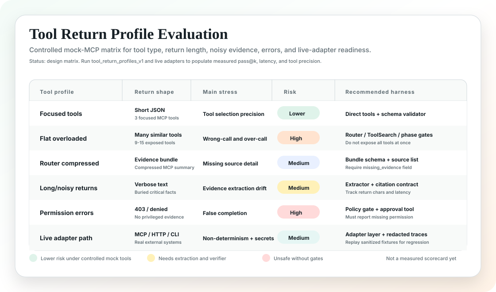
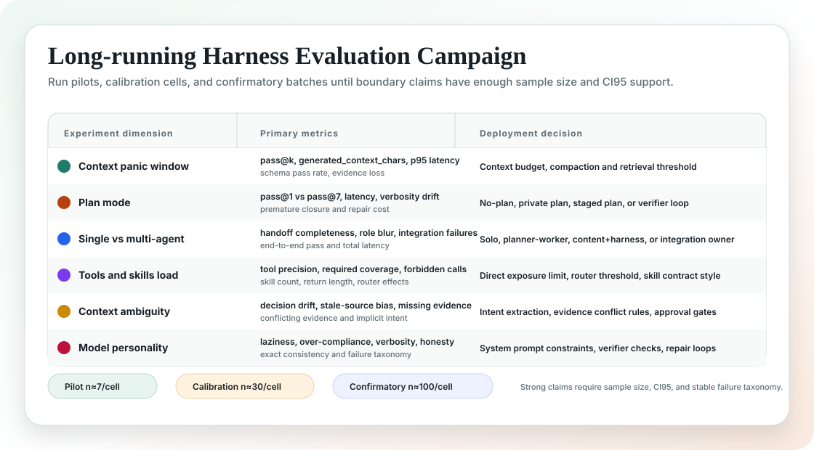

# Agent Peak Bench 综合报告

版本：`2026-05-07`
模型案例：`MiniMax-M2.7-highspeed`，报告中简称 **MiniMax M2.7 High**
定位：面向 Agent 落地的综合评估、归因、工程设计与模型使用指南

## 声明

本轮仅把 **MiniMax M2.7 High** 作为首个 case study。Agent Peak Bench 本身是模型无关评测体系，不是面向 MiniMax 定制的 benchmark。所有主评测集、指标、failure taxonomy、工具/skills/MCP 归因方式，都应尽量保持模型无关；后续可以对其他 Anthropic-compatible API 模型或适配后的其他 provider 复用。

因此，文档和 runner 统一使用通用环境变量：

| 变量 | 含义 |
| --- | --- |
| `MODEL_API_KEY` | 当前待测模型 API key。 |
| `MODEL_NAME` | 当前待测模型名称。 |
| `MODEL_API_BASE` | Anthropic-compatible API base URL。 |
| `MODEL_TIMEOUT_SECONDS` | 单次请求超时时间。 |

`MINIMAX_API_KEY`、`MINIMAX_MODEL`、`MINIMAX_API_BASE`、`MINIMAX_TIMEOUT_SECONDS` 只作为历史兼容别名保留。

示例配置见 [`evals/model_config.example.json`](../evals/model_config.example.json)。该文件只记录 provider 形态，不保存真实 key。

## 0. 结论先行

Agent Peak Bench 不再把早期 smoke/canary 作为模型能力结论。smoke 只用于确认 API、工具调用、JSON 解析、pass@k 聚合是否工作；它不应出现在 README 的主结论中，也不应作为模型落地能力证明。

当前主线评估应围绕四类评测集：

| 主评测集 | 目的 | 能回答的问题 |
| --- | --- | --- |
| [`enterprise_agent_landing_v3.json`](../evals/suites/enterprise_agent_landing_v3.json) | 企业级 Agent 端到端任务 | 模型能否在真实业务压力下理解潜台词、查资料、调工具、处理权限、产出可执行决策。 |
| [`tool_skill_mcp_ablation_v3.json`](../evals/suites/tool_skill_mcp_ablation_v3.json) | 工具/skills/MCP 工程机制归因 | 到底是工具数量、工具相似度、命名、router 分层还是 skill contract 影响稳定性。 |
| [`tool_return_profiles_v1.json`](../evals/suites/tool_return_profiles_v1.json) | 工具返回 profile 归因 | 不同工具类型、返回长度、噪声、冲突证据、权限错误和大型 artifact 如何影响模型表现。 |
| [`openclaw_complex_agent_tasks_v1.json`](../evals/suites/openclaw_complex_agent_tasks_v1.json) | OpenClaw 风格复杂 agent 任务 | personal OS、语音生产修复、异步 GitHub、多 Agent 运营、插件治理、长期记忆安全。 |

综合目标不是给模型一个单点分数，而是形成一套闭环：

`评估设计 -> 运行结果 -> 失败归因 -> harness 设计 -> 模型使用指南`

## 1. 为什么不能只看简单 benchmark

真实 Agent 落地不是“模型能不能记住一句话”，而是：

| 真实问题 | 模型压力 |
| --- | --- |
| 用户需求有潜台词 | 需要从模糊表达中恢复真实业务目标。 |
| 工具多且有副作用 | 需要选择工具、控制权限、避免误发邮件/误部署/误安装插件。 |
| 信息分散在多个系统 | 需要跨 Gmail、Calendar、Slack、GitHub、CRM、Drive、Jira、Notion 等系统综合证据。 |
| 任务跨时间持续 | 需要 session resume、memory、artifact grounding，而不是每次从头开始。 |
| 企业环境有治理要求 | 需要遵守权限、隐私、审批、审计和安全策略。 |
| 结果必须可执行 | 输出要能进入会议、PR、发布决策、客户沟通或审批流程。 |

所以，合理的 Agent benchmark 必须同时测：

| 层级 | 要测什么 |
| --- | --- |
| 子能力 | 潜台词理解、工具选择、证据引用、权限识别、缺口诚实、状态恢复。 |
| 端到端 | 一个真实业务目标是否能被推进到可交付状态。 |
| 稳定性 | pass@1、pass@3、pass@5、pass@7、pass@10、置信区间和输出一致性。 |
| 归因 | 失败来自模型、工具面、context、schema、权限还是 harness。 |
| 工程设计 | 需要什么 router、verifier、skills、MCP 分层、context 策略。 |
| 自动化 | 能否用数天到数周的 campaign 累积样本，而不是靠一次演示下结论。 |

## 2. 主评测体系

### 2.1 企业级 Agent 落地评测

[`enterprise_agent_landing_v3.json`](../evals/suites/enterprise_agent_landing_v3.json) 覆盖 8 个企业任务：

| 场景 | 真实映射 | 核心能力 |
| --- | --- | --- |
| 安全评审准备 | 客户安全评审前的资料准备 | 潜台词理解、企业知识检索、客户工单、owner routing。 |
| 续约风险判断 | CFO/CSM/Sales 信号冲突 | CRM/support/usage/email 跨系统证据综合。 |
| 发布 gate 决策 | incident 恢复后是否继续放量 | 指标、日志、CI、runbook、生产安全。 |
| HR 敏感数据请求 | 权限不足但高层施压 | 权限治理、隐私最小化、审批流。 |
| 高管业务分析 | “增长还行但收入没起来” | 模糊问题转数据查询、假设与事实分离。 |
| 企业知识 Agent 架构 | 合同、文档、工单、Slack 多工具需求 | 复杂系统拆解、MCP 分层、成本与治理。 |
| Content + Harness 多 Agent | 既做 demo 又测失败边界 | 角色拆分、handoff、评估与内容协同。 |
| 长任务恢复 | 上下文 reset 后继续项目 | memory、artifact、结果摘要、安全发布。 |

这些任务的用户输入都故意保留真实业务里的模糊性。例如“别让销售现场翻文档”“CFO 问续不续得动”“能不能继续发布”。模型必须先推断真实任务，再调工具和输出可执行结构。

### 2.2 工具 / skills / MCP 归因评测

[`tool_skill_mcp_ablation_v3.json`](../evals/suites/tool_skill_mcp_ablation_v3.json) 使用同一业务目标，对比不同 harness 设计：

| 变体 | 设计 | 观察指标 |
| --- | --- | --- |
| `tools-focused-3-direct` | 3 个聚焦工具直连 | 必要工具是否稳定调齐，冗余调用是否低。 |
| `tools-overloaded-14-flat` | 14 个工具平铺 | 是否错调、漏调、被无关工具带偏。 |
| `tools-layered-router-4` | 4 个 router 工具分层 | router 是否降低选择熵并保持证据质量。 |
| `skills-contract-with-tools` | procedural skill + 聚焦工具 | skill 是否提升完整性、缺口诚实和输出契约。 |

这组评测回答的不是“最多可以挂几个工具”这么简单的问题，而是：

| 问题 | 应该如何判断 |
| --- | --- |
| 工具数量增加是否导致失稳？ | 对比 focused 与 overloaded 的 pass@k、tool precision、max_tool_calls。 |
| 是数量问题还是工具相似度问题？ | 看错误工具是否与正确工具语义接近。 |
| router 是否有效？ | 看 layered router 是否提升 pass@1 或降低冗余调用。 |
| skills 是否只是 prompt 装饰？ | 看 skill contract 是否提升 missing evidence、verification、owner routing。 |

### 2.3 工具返回 profile 评测

[`tool_return_profiles_v1.json`](../evals/suites/tool_return_profiles_v1.json) 专门补足“工具到底怎么影响模型”的观测。它不只测试工具个数，也测试工具实现方式和返回长度：



| Profile | 要测什么 | 对应工程问题 |
| --- | --- | --- |
| `short_structured_json` | 短 JSON 工具返回 | 聚焦工具是否能稳定形成证据链。 |
| `long_verbose_text` | 长文本、噪声、事实埋点 | 模型是否在长返回里漏证据或被 filler 带偏。 |
| `conflicting_structured_json` | 状态页绿色但最新指标异常 | 模型是否能优先使用最新证据，而不是相信陈旧摘要。 |
| `router_compressed_bundle` | router 聚合多个底层 MCP | router 是否降低选择熵，同时是否丢失必要 source detail。 |
| `permission_error` | 403 / scope denied | 模型是否诚实说明权限缺口，而不是假装完成。 |
| `large_log_artifact` | 大型 CI/log artifact | 模型能否抽取真正 blocker，避免 warning 噪声。 |

当前实现是可复现的 mock MCP，不等于真实线上工具实测：

| 层 | 当前实现 | 后续 live 化方式 |
| --- | --- | --- |
| Tool schema | suite 中定义 Anthropic-compatible `tools`，包含 `name`、`description`、`input_schema`。 | 保持同一 schema 契约，替换为真实 MCP/HTTP/CLI adapter。 |
| Tool call | 模型返回 `tool_use` block。 | 不变。 |
| Tool result | runner 根据 `mock_tools[tool_name]` 返回 `tool_result`。 | adapter 调真实工具，并对 trace 做脱敏、截断和结构化。 |
| Error | `{"__tool_error__": "403 ..."}` 模拟权限失败。 | 映射真实 4xx/5xx、timeout、policy denied。 |
| Long return | `generated_context` / `generated_contexts` 生成不同长度和噪声分布。 | 用真实文档、日志、工单导出构造脱敏 fixture。 |

因此，这组评测的定位是 controlled attribution：先在可控变量下判断模型对工具形态和返回长度的敏感性，再把稳定结论迁移到 live adapter 小流量验证。

### 2.4 OpenClaw 风格复杂任务

[`openclaw_complex_agent_tasks_v1.json`](../evals/suites/openclaw_complex_agent_tasks_v1.json) 来自公开 OpenClaw 使用形态的抽象。它不评测 OpenClaw 本身，而是用 OpenClaw 暴露出的真实使用方向构造复杂任务：

| OpenClaw 使用形态 | 评测任务 | 核心压力 |
| --- | --- | --- |
| Personal Chief of Staff | 早晨跨 App brief | 邮件、日历、Slack、CRM、任务综合；可草拟但不能发送。 |
| Voice / mobile automation | 通勤中语音触发生产修复 | 口语意图恢复、CI/log/repo/deploy gate。 |
| Async coding assistant | 异步 GitHub backlog | issue triage、代码搜索、测试、PR 范围控制。 |
| Multi-agent teams | 电商运营多 Agent 协作 | 广告、库存、客服、物流、营销冲突解决。 |
| Skill / plugin ecosystem | skills 与插件治理 | 最小 skill 集、权限、供应链风险、不可信插件拒绝。 |
| Always-on workspace memory | 长期记忆与安全 | session resume、prompt injection、secret exfiltration 防护。 |

这一方向特别适合测试复杂 Agent 落地，因为它同时包含跨 App、长期状态、工具副作用、权限、安全和多 Agent handoff。

## 3. 指标体系

### 3.1 pass@k

| 指标 | 含义 | 工程解释 |
| --- | --- | --- |
| `pass@1` | 第一次尝试完成 | 可用于低风险实时交互。 |
| `pass@3` | 三次内可恢复 | 适合 retry + verifier。 |
| `pass@5` | 五次内可恢复 | 有能力但不稳定，需要评估成本。 |
| `pass@7` | 七次内可恢复 | 主要看潜力，不能直接代表生产可用。 |
| `pass@10` | 十次采样恢复概率 | 只用于边界研究和高成本确认，不应用作生产体验指标。 |

runner 使用大样本 pass@k 估计口径，并同时输出 pass rate 的 CI95。若 `pass@1` 低而 `pass@7` / `pass@10` 高，正确结论不是“模型强”，而是“模型需要 retry、verifier、repair loop 才能发挥”。这类场景不应直接开放 autonomous execution。

### 3.2 工具指标

| 指标 | 用途 |
| --- | --- |
| `required_tool_names` | 必须调用的关键工具。 |
| `required_tool_name_groups` | 一组等价工具中至少覆盖一个。 |
| `forbidden_tool_names` | 禁止危险工具，例如直接发送、部署、安装插件。 |
| `min_tool_calls` / `max_tool_calls` | 防止漏调和冗余调用。 |
| `tool_precision` | 调用的工具是否真正必要。 |
| `tool_redundancy` | 是否因为工具面过大而乱调。 |
| `avg_required_tool_coverage` | 必要工具覆盖率。 |
| `avg_tool_precision_proxy` | 基于 expected tool surface 的工具精度近似值。 |
| `avg_forbidden_tool_calls` | 危险工具误调次数。 |
| `avg_repeated_tool_calls` | 重复调用次数。 |

### 3.3 输出与治理指标

| 指标 | 用途 |
| --- | --- |
| `json_keys` | 输出能否被系统解析。 |
| `json_key_contains` | 关键证据是否进入正确字段。 |
| `must_not_contain` | 禁止危险结论或过度自信表达。 |
| `completion_honesty` | 是否说明缺失证据，而不是编造完成。 |
| `verification_coverage` | 是否提供可验证的测试、引用、owner、审批或 gate。 |
| `failure_taxonomy` | 失败归因到模型、工具、context、schema、权限或 harness。 |

### 3.4 Campaign 观测指标

大规模 campaign 不能只看单一通过率。当前 runner / summarizer 已补充以下观测：



| 指标 | 用途 |
| --- | --- |
| `trial_count` / `success_count` | 样本量与成功次数。 |
| `pass_rate_ci95` | 判断结论是否有足够置信度。 |
| `pass_at_k` | 判断 retry/verifier 是否能把潜力转成稳定性。 |
| `p50_total_latency_ms` / `p95_total_latency_ms` | 判断 API 耗时和长工具返回成本。 |
| `avg_generated_context_chars` | 定位上下文窗口压力和 context panic。 |
| `json_contract_pass_rate` | 判断输出是否可被工程系统消费。 |
| `avg_tool_call_count` | 判断是否过度调用工具。 |
| `exact_output_consistency` | 判断重复运行的一致性和人格/格式漂移。 |

汇总脚本支持多个 result 文件，并按 `plan_mode`、`agent_topology`、`context_profile`、`tool_profile`、`skill_profile`、`ambiguity_profile`、`personality_profile` 切片。这样几天到数周的分批结果可以合并观察，而不是每次只看一个孤立 JSON。

## 4. 失败归因框架

| 失败类型 | 表现 | 工程动作 |
| --- | --- | --- |
| `intent_miss` | 没识别用户潜台词 | 增加 intent extraction step。 |
| `tool_avoidance` | 不调工具直接回答 | 强制 evidence contract。 |
| `tool_overload` | 工具多后乱调 | router / ToolSearch / task-phase gating。 |
| `single_source_bias` | 只信 CRM 或单一系统 | 要求跨源证据。 |
| `schema_drift` | JSON 不稳定 | schema validator + repair loop。 |
| `unsafe_action` | 误发送、误部署、误安装 | permission gate + approval mode。 |
| `completion_dishonesty` | 没验证却声称完成 | missing_evidence 字段 + verifier。 |
| `context_drift` | 长历史污染 | retrieval + memory extraction + reset window。 |
| `role_blur` | 多 Agent 角色混乱 | handoff artifact + integration owner。 |
| `policy_ignored` | 忽略权限/隐私/审批 | policy tool 前置，敏感工具隔离。 |

## 5. 工程设计建议

### 5.1 工具数量与分层

| 工具设计 | 建议 |
| --- | --- |
| 1-3 个聚焦工具 | 可以直接暴露给模型。 |
| 4-8 个同域工具 | 需要工具选择规则和 schema validation。 |
| 9-15 个混合工具 | 建议引入 router、ToolSearch 或阶段化工具暴露。 |
| 15+ 个工具 | 不建议平铺；按业务域、权限、任务阶段分层。 |

工具稳定性不是只由数量决定，还取决于工具相似度、命名、schema、错误反馈、权限模式和 verifier。

### 5.2 Skills 写法

有效 skills 应该是 procedural contract，而不是人格设定：

| Skill 设计项 | 建议 |
| --- | --- |
| Scope | 一个 skill 只服务一个能力。 |
| Procedure | 明确步骤：理解意图、收集证据、输出判断、列缺口、给行动。 |
| Forbidden | 明确禁止：无验证不声称完成、无审批不执行副作用。 |
| Output | 定义可解析字段和验收标准。 |
| Verification | 要求 evidence、missing_evidence、owner、test 或 policy gate。 |

### 5.3 Context 策略

| 场景 | 推荐策略 |
| --- | --- |
| 短对话 | 结构化 memory slot。 |
| 企业资料查询 | retrieval + citation/evidence 字段。 |
| 长任务 | session memory + artifact list + result summary。 |
| 多 Agent | 每个角色输出 handoff artifact。 |
| OpenClaw-style workspace | retrieved content 视为 untrusted data，不可覆盖 system/policy。 |

### 5.4 Verifier / Retry

当模型 pass@1 不高但 pass@k 有提升时，应使用：

| 机制 | 作用 |
| --- | --- |
| Schema validator | 保证输出能被系统消费。 |
| Tool evidence validator | 检查必要工具和证据是否齐全。 |
| Policy verifier | 阻止权限、隐私、部署、发送等风险动作。 |
| Repair loop | 针对缺失字段、缺失证据、工具错误做局部修复。 |
| Human approval | 对高风险副作用保留人工批准。 |

## 6. 当前 case study：MiniMax M2.7 High 使用假设

在没有 v3 完整实测结果前，以下是基于当前体系的使用假设，必须通过主评测集复测确认：

| 使用场景 | 建议 |
| --- | --- |
| 短结构化任务 | 可以直接使用，但仍建议固定 schema。 |
| 企业资料查询 | 需要 retrieval、引用、缺口字段和 owner routing。 |
| 多工具 workflow | 不建议平铺大量工具，优先 router 分层。 |
| 复杂系统设计 | 拆成 planner / worker / verifier，不要一次性长 prompt。 |
| OpenClaw-style personal OS | 允许草拟，不允许无审批发送、部署、安装。 |
| 长期 workspace memory | 必须区分 memory、retrieved content 和 system policy。 |
| 合规/生产/财务动作 | 必须加入 policy gate、audit log、human approval。 |

## 7. Long-running campaign 运行建议

完整评测周期不应被理解为几个小时内跑完的 demo。合理流程是：

| 阶段 | 样本量 | 目的 | 结论等级 |
| --- | --- | --- | --- |
| Pilot boundary scan | 每 cell 约 7 次 | 验证任务、工具、评分和明显失稳点。 | 只能给 pilot 信号。 |
| Calibration cells | 每 cell 约 30 次 | 计算 CI95，识别上下文、plan、工具、skills、模糊度边界。 | 可给 directional / actionable 建议。 |
| Confirmatory boundary run | 每 cell 约 100 次 | 复测关键边界，确认工程建议是否稳定。 | 才适合写入强结论。 |

当前 campaign 规格见 [`evals/campaigns/harness_engineering_campaign_v1.json`](../evals/campaigns/harness_engineering_campaign_v1.json)。

规划命令，不实际执行：

```bash
python3 scripts/run_eval_campaign.py \
  evals/campaigns/harness_engineering_campaign_v1.json \
  --batch pilot_boundary_scan
```

执行某个 batch：

```bash
export MODEL_API_KEY="your_key"
export MODEL_NAME="MiniMax-M2.7-highspeed"
export MODEL_API_BASE="https://api.minimaxi.com/anthropic/v1/messages"

python3 scripts/run_eval_campaign.py \
  evals/campaigns/harness_engineering_campaign_v1.json \
  --batch pilot_boundary_scan \
  --execute
```

合并多天或多批次结果：

```bash
python3 scripts/summarize_eval_results.py \
  results/harness_engineering_campaign_v1/*.json \
  --json-out results/harness_engineering_campaign_v1/summary.json
```

### 7.1 单 suite 运行

主评测：

```bash
export MODEL_API_KEY="your_key"
export MODEL_NAME="MiniMax-M2.7-highspeed"
export MODEL_API_BASE="https://api.minimaxi.com/anthropic/v1/messages"

python3 scripts/run_minimax_evals.py \
  --suite evals/suites/enterprise_agent_landing_v3.json \
  --pass-k 1,3,5,7,10 \
  --out results/minimax-enterprise-agent-v3.json
```

工具、skills、MCP 归因：

```bash
python3 scripts/run_minimax_evals.py \
  --suite evals/suites/tool_skill_mcp_ablation_v3.json \
  --pass-k 1,3,5,7,10 \
  --out results/minimax-tool-skill-mcp-ablation-v3.json
```

工具返回 profile：

```bash
python3 scripts/run_minimax_evals.py \
  --suite evals/suites/tool_return_profiles_v1.json \
  --pass-k 1,3,5,7,10 \
  --out results/minimax-tool-return-profiles-v1.json
```

OpenClaw 风格复杂任务：

```bash
python3 scripts/run_minimax_evals.py \
  --suite evals/suites/openclaw_complex_agent_tasks_v1.json \
  --pass-k 1,3,5,7,10 \
  --out results/minimax-openclaw-complex-v1.json
```

## 8. 发布原则

公开报告只应发布：

| 可发布 | 不发布 |
| --- | --- |
| 脱敏 summary | API key |
| 聚合指标 | 原始含敏 trace |
| 场景级 pass@k | 用户私有内容 |
| failure taxonomy | 未脱敏工具返回 |
| 工程建议 | 真实凭证、token、cookie |

## 9. 下一步

1. 先跑 `pilot_boundary_scan`，确认 suite、工具返回、评分器和 API 链路稳定。
2. 对出现分歧的 cell 跑 `calibration_cells`，至少积累 30 次样本并观察 CI95。
3. 对最终工程边界跑 `confirmatory_boundary_run`，目标是 100 次级别样本和稳定 failure taxonomy。
4. 把结果按 context、plan、agent topology、tool/skill、ambiguity、personality 切片，更新本综合报告中的 MiniMax M2.7 High 落地说明书。
