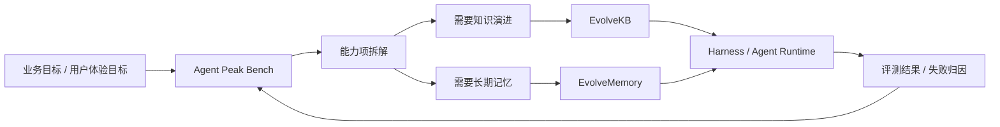

# 三项目 GitHub Repo 产品评审与路线图

版本：`2026-05-11`

对象：

- [EvolveKB](https://github.com/2sao7sao/EvolveKB)
- [EvolveMemory](https://github.com/2sao7sao/EvolveMemory)
- [Agent Peak Bench](https://github.com/2sao7sao/agent-peak-bench)

评审视角：高级独立开发者 + 产品设计师 + Agent 落地工程视角。

## 0. 总结

这三个仓库不应该被理解为三个彼此独立的小项目。更合理的组合定位是：

> **Evolve Stack：让 Agent 拥有可演进知识、克制记忆，以及可验证的商业落地评测。**

| 项目 | 最核心的一句话 | 当前阶段 | 主要缺口 |
| --- | --- | --- | --- |
| EvolveKB | 把文档变成可验证、可执行、可持续更新的 agent knowledge runtime。 | `S1.7 / 工作原型 -> 产品化前夜` | 需要从“不是 RAG”进一步证明“为什么比 RAG 更能让 agent 变聪明”。 |
| EvolveMemory | 让 conversational AI 知道用户是谁、该如何交流，并知道什么时候不要使用记忆。 | `S1.7 / 强产品直觉的工作原型` | 需要可视化 demo 和“不过度记忆 / 不尴尬提及”的评测证据。 |
| Agent Peak Bench | 从商业目标反推模型能力、工程手段和最佳 agent 搭建方案。 | `S2.0 / 方法论 + 评测基础设施 pilot` | 需要更多模型、更多业务、更多重复实验，以及更明确的 dashboard 化产物。 |

当前最大问题不是代码量不足，而是**公开表达还没有形成爆款 GitHub 项目的第一屏冲击力**：用户应该在 30 秒内理解它解决什么痛点、为什么现有方案不够、如何运行、运行后会得到什么、结果是否可信。

本次根据评审已落地三类增量：

| 项目 | 已落地 |
| --- | --- |
| EvolveKB | 修复 reviewer 环境下 CLI 子进程测试导入问题，补充知识演进闭环与 flagship demo。 |
| EvolveMemory | 补充“明确不用提某事件时抑制记忆”的 gate 行为、测试和 replay demo。 |
| Agent Peak Bench | 新增 business-goal YAML profiles 与 suite skeleton 生成器，作为业务目标到 benchmark 的入口。 |

## 1. 评审方法与公开信号

本轮使用三类依据：

| 来源 | 用途 |
| --- | --- |
| GitHub REST repo metadata | 查看 stars、forks、活跃度与对照项目规模。快照见 [`research/github_repo_review/signals_2026-05-11.json`](../research/github_repo_review/signals_2026-05-11.json)。 |
| 本地仓库 README、代码结构、测试命令 | 判断项目实际成熟度、文档叙事和可运行性。 |
| 当前热门 agent/RAG/memory/eval 项目 | 对比爆款仓库如何做定位、demo、quickstart、指标和社区扩散。 |

本地验证结果：

| 项目 | 命令 | 结果 | 备注 |
| --- | --- | --- | --- |
| Agent Peak Bench | `python3 scripts/check_benchmark_distribution.py` | `PASS`，104 scenarios | 当前评测集分布检查可运行。 |
| EvolveMemory | `python -m pytest -q` | `51 passed` | 测试入口清晰。 |
| EvolveKB | `python -m pytest -q` | `53 passed, 4 failed` | 在未执行 editable install 的 reviewer 环境下，CLI 子进程进入临时目录后找不到 `evolvekb` 包。 |
| EvolveKB | `PYTHONPATH=/abs/path/EvolveKB python -m pytest -q` | `57 passed` | 说明核心代码可跑，但测试/README 需要明确安装或路径前提。 |

公开信号快照：

| 项目 | Stars | Forks | 推送时间 | 结论 |
| --- | ---: | ---: | --- | --- |
| EvolveKB | 2 | 0 | 2026-05-07 | 还没有外部传播，处于项目定义期。 |
| EvolveMemory | 1 | 0 | 2026-05-07 | 还没有外部传播，依赖 demo 和叙事破圈。 |
| Agent Peak Bench | 0 | 0 | 2026-05-09 | 方法论有差异化，但还没有公共可信样本。 |

对照项目信号：

| 类型 | 代表项目 | 当前形态 | 可学习点 |
| --- | --- | --- | --- |
| Agent workflow platform | [Dify](https://github.com/langgenius/dify) | 14 万 stars 级平台 | 强 UI、强落地场景、强部署叙事。 |
| 软件工程 Agent | [OpenHands](https://github.com/All-Hands-AI/OpenHands) | 7 万 stars 级 agent 产品 | 场景极清晰：AI-driven development。 |
| Agent 编排 | [LangGraph](https://github.com/langchain-ai/langgraph)、[AutoGen](https://github.com/microsoft/autogen)、[CrewAI](https://github.com/crewAIInc/crewAI) | 框架与生态 | 一句话定位 + 文档站 + 示例生态。 |
| RAG / Context | [RAGFlow](https://github.com/infiniflow/ragflow)、[LlamaIndex](https://github.com/run-llama/llama_index) | context/data 平台 | 把复杂能力包装成用户能直接运行的产品路径。 |
| Memory | [mem0](https://github.com/mem0ai/mem0)、[Letta](https://github.com/letta-ai/letta)、[Zep](https://github.com/getzep/zep) | 记忆层 / stateful agents | 简洁定位、SDK 使用路径、集成生态。 |
| Agent benchmark | [SWE-bench](https://github.com/SWE-bench/SWE-bench)、[OSWorld](https://github.com/xlang-ai/OSWorld)、[tau-bench](https://github.com/sierra-research/tau-bench)、[WorkArena](https://github.com/ServiceNow/WorkArena)、[TheAgentCompany](https://github.com/TheAgentCompany/TheAgentCompany) | 可执行评测环境 | 数据集、环境、评分、论文式报告和 leaderboard。 |

爆款仓库不是只靠 README 好看，而是满足四个条件：

| 条件 | 具体表现 |
| --- | --- |
| 价值一眼能懂 | 第一屏回答“为什么我现在需要它”。 |
| 运行路径极短 | 复制 3 到 5 行命令就能看到结果。 |
| 有可传播 demo | gif、截图、before/after、在线 demo 或 notebook。 |
| 可信度可复查 | 有测试、benchmark、样本、失败边界和 roadmap。 |

## 2. 阶段判断标准

| 阶段 | 判断标准 |
| --- | --- |
| `S0 Idea` | 只有概念和草稿，没有稳定代码。 |
| `S1 Working Prototype` | 有核心代码、测试和最小 demo，但未形成外部用户可快速理解的产品。 |
| `S2 Credible OSS Product` | README、quickstart、示例、测试、指标、边界说明完整，陌生用户能复现价值。 |
| `S3 Community Project` | 有真实用户、issue、PR、案例、插件或集成。 |
| `S4 Platform / Ecosystem` | 有生态位、文档站、治理、商业化路径和外部贡献循环。 |

三个项目目前都跨过了 `S1`，但还没有达到 `S3`。现在的关键不是继续堆功能，而是把每个项目的**不可替代性、最小成功体验和可信证据**打磨出来。

产品化评分是 repo review 的主观判断，不是模型能力或代码质量分数：

| 维度 | EvolveKB | EvolveMemory | Agent Peak Bench | 说明 |
| --- | ---: | ---: | ---: | --- |
| 定位清晰度 | 4 | 4 | 4 | 三者都有明确差异点，但第一屏仍可更锋利。 |
| Quickstart 可信度 | 3 | 4 | 4 | EvolveKB 需要修正测试前提；另外两者入口较清楚。 |
| Demo 传播力 | 2 | 2 | 3 | 当前还缺 gif、截图、before/after 和真实样本故事。 |
| 指标说服力 | 2 | 2 | 3 | 三者都有 seed，但还没有达到外部可信 benchmark 规模。 |
| 工程结构 | 4 | 4 | 4 | 代码骨架已经超过概念项目。 |
| 设计与排版 | 3 | 3 | 3 | 当前比早期好，但还没有形成高级产品页的记忆点。 |
| 社区就绪度 | 2 | 2 | 2 | 缺少 issue 模板、贡献路径、roadmap issue、示例库和外部集成。 |

## 3. EvolveKB 评审

### 3.1 原始目标对齐

EvolveKB 的灵感很清楚：传统知识库 / RAG 只把模型带到少量 embedding 相似片段附近，模型并不知道完整知识、隐藏关联、知识使用方法，也不会因为实践结果持续修正知识。人类学习不是“检索相似片段”，而是：

```text
挖掘 -> 理解 -> 组织 -> 使用 -> 验证 -> 推翻/修正 -> 形成方法论
```

因此 EvolveKB 的正确定位不应是“更好的 RAG”，而应是：

> **Knowledge Evolution Runtime：把知识从静态文档变成可执行、可验证、可审计、可演进的 agent 方法论。**

### 3.2 当前优势

| 优势 | 说明 |
| --- | --- |
| 概念差异足够大 | “execution-first knowledge” 与普通向量检索有清晰区隔。 |
| 工程骨架已经存在 | 有 assets、usage assets、skills、gates、proposal、eval runner、CLI。 |
| README 已经避免“AI 读项目记录”的问题 | 当前 README 更像开源项目介绍，而不是内部日志。 |
| 测试覆盖面不错 | 覆盖 schema、registry、gates、retrieval、skills、proposal、CLI。 |

### 3.3 主要问题

| 问题 | 严重度 | 影响 |
| --- | --- | --- |
| 第一屏还不够尖锐 | P1 | 用户仍然可能把它理解为“另一个知识库工具”。 |
| 缺少 killer demo | P1 | 没有一个场景能立刻证明它比 RAG 更适合 agent。 |
| eval 太小 | P1 | 目前 retrieval/routing seed 只能证明回归路径，不能证明知识演进能力。 |
| “实践验证知识”没有被充分产品化 | P1 | 原始灵感中最有价值的 `使用结果反推知识更新` 还没有成为 README 主叙事。 |
| plain `pytest` 前提不清 | P2 | 陌生用户可能认为测试失败，降低可信度。 |

### 3.4 建议的第一屏表达

建议 README 第一屏改成更锋利的产品表达：

```text
EvolveKB turns documents into evolving agent skills.

RAG retrieves similar fragments. EvolveKB verifies how knowledge should be used.
It lets agents read documents, distill claims, build playbooks, execute skills,
run gates, observe failures, and propose knowledge updates through auditable PRs.
```

中文版本：

```text
EvolveKB 不是一个向量知识库。
它把知识变成 agent 可以执行、可以验证、可以持续修正的方法论。
```

### 3.5 最该补的 demo

| Demo | 为什么重要 |
| --- | --- |
| `Policy doc -> Support refund skill` | 企业用户能直观看到“文档如何变成可执行流程”。 |
| `Research notes -> Agent playbook` | 展示隐藏关联、claim、证据和使用方法的生成。 |
| `Incident runbook -> Verified update` | 展示实践失败后如何反推知识库更新。 |
| `RAG baseline vs EvolveKB` | 用同一问题对比“只检索片段”和“使用 playbook + gate”的差异。 |

### 3.6 建议指标

| 指标 | 定义 | 意义 |
| --- | --- | --- |
| `claim_grounding_rate` | 生成 claim 中有证据支撑的比例。 | 防止知识资产变成幻觉。 |
| `usage_playbook_success_rate` | playbook 是否能完成目标任务。 | 衡量知识是否真的可用。 |
| `hidden_dependency_discovery` | 是否发现文档间隐含依赖。 | 对齐“知识不是相似片段”的初心。 |
| `proposal_acceptance_rate` | 生成的知识更新 proposal 被 gate 接受比例。 | 衡量演进质量。 |
| `regression_guard_pass` | 知识更新后旧任务是否仍通过。 | 防止知识漂移。 |
| `rag_delta` | 相比普通 RAG 的任务成功差值。 | 用外部用户能懂的方式证明价值。 |

### 3.7 下一步路线

| 时间 | 动作 |
| --- | --- |
| 7 天 | 修正测试说明或测试环境；新增一个完整 demo：文档 -> skill -> eval -> proposal。 |
| 30 天 | 构建 20 到 50 个知识使用任务，加入 RAG baseline 对照。 |
| 90 天 | 做成 `knowledge evolution benchmark`，形成可视化报告和 GitHub Action gate。 |

## 4. EvolveMemory 评审

### 4.1 原始目标对齐

EvolveMemory 的目标不是“存更多记忆”，而是让模型更像真正理解用户：

- 知道用户经历了什么。
- 理解用户的思维方式、知识水平、表达偏好和心理状态。
- 用用户更容易接受的方式交流。
- 不要为了显得懂用户而尴尬地提起无关记忆。
- 对敏感、过期、低置信度记忆保持克制。

最准确的定位应该是：

> **Adaptive Memory Runtime：让 AI 记得该记的，也知道什么时候闭嘴。**

### 4.2 当前优势

| 优势 | 说明 |
| --- | --- |
| 产品洞察强 | 明确区分 memory retrieval 与 memory permission。 |
| 工程层次完整 | 有提取、写入治理、SQLite、retrieval、use gate、response policy、review/audit。 |
| 与现有 memory 项目有差异 | mem0/Zep/Letta 更强调 memory layer，EvolveMemory 更强调“是否该用、如何用”。 |
| 测试当前可运行 | `51 passed`，基础可信度好于纯概念项目。 |

### 4.3 主要问题

| 问题 | 严重度 | 影响 |
| --- | --- | --- |
| 缺少情感化 demo | P1 | 记忆产品的价值必须被用户“感受到”，不是只看 API。 |
| 缺少“克制使用”的量化证明 | P1 | 原始目标中的“不刻意牵扯信息”还没有形成指标。 |
| README 仍偏工程 | P2 | 产品体验、对话变化、memory inspector 视觉还不足。 |
| 与 mem0/Letta/Zep 的差异需要更直接 | P2 | 需要一张对比表说明不是重复造轮子。 |

### 4.4 建议的第一屏表达

```text
EvolveMemory is an adaptive memory runtime for conversational AI.

It does not just retrieve memories. It decides what to remember, what to forget,
when to use memory directly, when to only adapt style, and when to stay silent.
```

中文版本：

```text
EvolveMemory 让 AI 不只是记住你，而是更自然地理解你。
它知道什么时候该用记忆，也知道什么时候不该提。
```

### 4.5 最该补的 demo

建议做一个 README 内嵌的 `5-turn before/after`：

| Turn | 用户输入 | 系统行为 |
| --- | --- | --- |
| 1 | “我最近准备面试，有点焦虑。” | 写入 event + emotional state，低置信敏感状态进 review。 |
| 2 | “回答直接一点，先给结论。” | 写入 communication preference。 |
| 3 | “帮我做面试计划。” | 使用 direct memory + style memory。 |
| 4 | “今天聊代码，不用提面试。” | gate 抑制面试事件。 |
| 5 | “其实我不想让你记住焦虑这件事。” | correction/delete + audit。 |

每一步都展示：

```text
extracted memories -> write decision -> retrieved memories -> use gate -> response policy
```

### 4.6 建议指标

| 指标 | 定义 | 意义 |
| --- | --- | --- |
| `write_precision` | 写入的记忆是否真的值得长期保存。 | 防止记忆污染。 |
| `use_appropriateness` | 被使用的记忆是否与当前任务相关且合适。 | 防止乱用记忆。 |
| `creepy_recall_rate` | 不该提却提到用户隐私/旧事的比例。 | 衡量“不过度”的核心指标。 |
| `style_adaptation_score` | 是否按用户偏好调整结构、细节和语气。 | 衡量对话体验。 |
| `correction_success_rate` | 用户纠正后旧记忆是否被正确退休。 | 衡量可控性。 |
| `stale_memory_suppression` | 过期记忆是否被抑制。 | 防止长期漂移。 |
| `memory_token_budget` | memory context 占用 token。 | 衡量工程可用性。 |

### 4.7 下一步路线

| 时间 | 动作 |
| --- | --- |
| 7 天 | 增加一个可截图的 chat playground 或 terminal replay demo。 |
| 30 天 | 做 100 到 300 条多轮对话评测，覆盖敏感、过期、纠正、风格适配和无关记忆抑制。 |
| 90 天 | 与 mem0/Letta/Zep 做同场景对照，并把 EvolveMemory 定位成“memory use governance layer”。 |

## 5. Agent Peak Bench 评审

### 5.1 原始目标对齐

Agent Peak Bench 的目标不是普通 leaderboard，而是：

```text
用户业务想法 -> 是否适合 AI -> 能力项拆解 -> benchmark -> 多模型边界测试
-> 失败归因 -> agent 搭建方案 -> 模型厂商反馈
```

这条线是非常有价值的。它解决的是企业真正关心的问题：

> 不是“哪个模型榜单分高”，而是“我的业务目标应该用哪个模型、怎么搭 agent、哪里必须加 harness、哪些环节不能自动化”。

### 5.2 当前优势

| 优势 | 说明 |
| --- | --- |
| 差异化足够明显 | 从商业目标出发，而不是从模型能力题库出发。 |
| 评测集已经扩展 | 当前有 104 scenarios，覆盖 business goal、tools、context、multi-agent、governance。 |
| MiniMax case study 已经建立样例 | 虽然还小，但能展示从结果到 cookbook 的路径。 |
| README 已经模型无关化 | 通用 `MODEL_*` 变量避免被误解为 MiniMax 专项。 |

### 5.3 主要问题

| 问题 | 严重度 | 影响 |
| --- | --- | --- |
| 当前仍缺多模型对照 | P1 | 没有多模型就很难证明 benchmark 的区分度。 |
| business goal 还偏“设计题” | P1 | 需要更多可执行 end-state、mock tools、trace 和 business KPI。 |
| 图表与报告还未 dashboard 化 | P2 | GitHub 用户难以快速理解每个指标的业务意义。 |
| MiniMax 样本仍是 pilot | P2 | r7 只能做方向信号，不能做强边界声明。 |
| business intake 入口刚建立 | P2 | 已新增 profile 与 generator，但还需要更多真实客户案例和 scoring rubric。 |

### 5.4 建议的第一屏表达

```text
Agent Peak Bench turns business goals into agent deployment decisions.

It maps a user's commercial objective into model capabilities, benchmark suites,
failure attribution, and a practical cookbook for building the agent safely.
```

中文版本：

```text
Agent Peak Bench 把业务目标变成模型能力评测和 Agent 落地方案。
它不只回答模型强不强，而是回答这个业务该不该用 AI、该用哪个模型、该怎么搭 harness。
```

### 5.5 最该补的能力

| 能力 | 说明 |
| --- | --- |
| `business_goal_profile.yaml` | 用户输入业务目标、流程、系统、风险、KPI，自动生成能力拆解。 |
| `suite generator` | 根据 profile 生成 mock tools、scenarios、rubric、pass@k plan。 |
| `model comparison card` | 同一业务目标下比较 MiniMax、Claude、OpenAI、Qwen、DeepSeek 等模型。 |
| `deployment cookbook generator` | 输出 single/multi-agent、memory、RAG、MCP、skills、verifier、审批建议。 |
| `vendor feedback pack` | 输出可复现失败簇、最小 trace、建议训练/对齐方向。 |

### 5.6 商业目标扩展方向

这些方向更贴近 B 端真实落地：

| 业务方向 | 适合测试的 agent 能力 |
| --- | --- |
| 客服退款 / 工单升级 | 多轮澄清、policy following、审批流、禁用副作用工具。 |
| 销售续约 / churn 预警 | CRM、support、usage、email 多源冲突证据。 |
| 安全问卷 / 合规评审 | 企业知识检索、引用、owner routing、缺口诚实。 |
| 合同红线 / 法务初审 | clause extraction、风险等级、human approval、不可替代法务判断。 |
| 财务关账 / 异常定位 | SQL、ERP、表格、审计 trace、计算严谨性。 |
| 内部代码迁移 | repo navigation、测试选择、PR 范围控制、verifier。 |
| 发布内容生产 | claim grounding、素材检索、content + harness engineer 协作。 |
| HR / 绩效 / 敏感数据 | 权限、隐私、最小披露、拒绝策略。 |
| 采购 / 供应商评估 | 多文档证据、评分矩阵、审批、价格与风险分离。 |
| IT / SRE 运维 | incident runbook、日志判断、发布 gate、危险操作审批。 |

### 5.7 下一步路线

| 时间 | 动作 |
| --- | --- |
| 7 天 | 新增 `business_goal_profile` 模板和 3 个完整业务样例。 |
| 30 天 | 至少跑 3 个模型、3 个业务方向、每格 r30，输出 dashboard。 |
| 90 天 | 做成可复用的 `business-to-benchmark` 工具链和模型厂商反馈包。 |

## 6. 三项目组合定位

三个项目可以形成一条完整链路：



| 层 | 项目 | 职责 |
| --- | --- | --- |
| 业务评估层 | Agent Peak Bench | 判断需求是否适合 AI，拆能力，测模型，给 cookbook。 |
| 知识工程层 | EvolveKB | 把业务知识变成可执行、可验证、可演进的方法论。 |
| 用户理解层 | EvolveMemory | 让 agent 在对话中自然理解用户，并克制使用记忆。 |

这个组合的价值比单仓库更大：

> Agent Peak Bench 判断什么时候需要 EvolveKB / EvolveMemory；EvolveKB 和 EvolveMemory 反过来成为 Agent Peak Bench 可评测的工程手段。

## 7. README 与页面设计建议

### 7.1 通用结构

建议三个 README 都使用同一套信息架构：

| 区块 | 目的 |
| --- | --- |
| Hero | 一句话价值 + 一张图 + 3 个核心指标。 |
| Why now | 现有方案的问题。 |
| What it does | 用 3 到 5 个模块说明系统能力。 |
| Quick demo | 最小可运行示例，必须能复制执行。 |
| Example output | 展示真实产物，而不是只写命令。 |
| Metrics | 测试、eval、边界和当前不足。 |
| Architecture | 让工程用户相信可扩展。 |
| Roadmap | 告诉外部用户项目会往哪里走。 |

### 7.2 视觉风格

| 建议 | 理由 |
| --- | --- |
| 少用无意义 badge | badge 应服务可信度，不要堆装饰。 |
| 增加 before/after 截图 | 用户更容易理解“用了之后发生什么变化”。 |
| 每个项目保留一个主色 | EvolveKB 偏知识/执行，EvolveMemory 偏温度/克制，Agent Peak Bench 偏评测/决策。 |
| 图表必须标注业务意义 | 不只写 `score`，要写“tool precision: 工具选择是否必要”。 |
| 把测试指标和边界放一起 | 显得专业，也避免过度营销。 |

## 8. 优先级路线图

### P0：马上做

| 项目 | 动作 |
| --- | --- |
| EvolveKB | 修正测试前提说明；新增一个完整知识演进 demo；把“实践结果反推知识更新”放到 README 主叙事。 |
| EvolveMemory | 新增对话 replay demo；展示 memory use gate 的直接效果；增加 creepy recall / suppression 指标定义。 |
| Agent Peak Bench | 新增 business goal profile 模板；新增三类业务目标的 end-to-end fixture；生成第一版 dashboard。 |

### P1：30 天内做

| 项目 | 动作 |
| --- | --- |
| EvolveKB | 建立 RAG baseline 对照和 20+ 知识使用任务。 |
| EvolveMemory | 建立 100+ 多轮对话评测集，覆盖记忆写入、使用、抑制、纠正。 |
| Agent Peak Bench | 三模型、三业务方向、r30 重复实验，输出模型对比报告。 |

### P2：90 天内做

| 项目 | 动作 |
| --- | --- |
| EvolveKB | 做成 knowledge evolution benchmark，并支持 GitHub Action gate。 |
| EvolveMemory | 与 mem0/Letta/Zep 进行同场景对照，明确产品生态位。 |
| Agent Peak Bench | 做成 business-to-benchmark pipeline，支持模型厂商反馈包和客户业务 cookbook。 |

## 9. 不建议做什么

| 不建议 | 原因 |
| --- | --- |
| 继续堆抽象概念 | 当前已经有足够概念，缺的是 demo、数据和对照。 |
| 把 README 写成研究日志 | 开源用户需要先理解价值，再看细节。 |
| 过早承诺企业级生产可用 | 当前还缺大规模评测、权限、观测和真实集成验证。 |
| 把 Agent Peak Bench 做成普通 leaderboard | 它的差异点是 business goal -> agent cookbook，不是单纯排名。 |
| 把 EvolveMemory 做成“存更多”的 memory store | 真正差异是 use gate、克制、纠正和体验。 |
| 把 EvolveKB 做成“更复杂的 RAG” | 真正差异是知识用法、实践验证和演进治理。 |

## 10. 结论

三个项目目前都处于“有真实工程骨架，但还没完成开源产品化表达”的阶段。下一阶段的重点不是再写更多内部说明，而是把每个项目变成陌生 GitHub 用户能快速理解、快速运行、快速相信的开源产品。

最值得坚持的方向是：

| 项目 | 必须守住的核心 |
| --- | --- |
| EvolveKB | 知识不是相似片段，而是可验证、可执行、会被实践修正的方法论。 |
| EvolveMemory | 记忆不是多存信息，而是更自然、更克制、更懂用户的交流体验。 |
| Agent Peak Bench | 模型评测不是为了排名，而是为了业务落地、工程决策和模型厂商优化。 |

如果这三条线都能用 demo、数据、benchmark 和 dashboard 证明，它们就不是三个普通工具仓库，而是一套面向 Agent 时代的落地基础设施。

## Sources

- GitHub metadata snapshot: [`research/github_repo_review/signals_2026-05-11.json`](../research/github_repo_review/signals_2026-05-11.json)
- [Dify](https://github.com/langgenius/dify)
- [OpenHands](https://github.com/All-Hands-AI/OpenHands)
- [LangGraph](https://github.com/langchain-ai/langgraph)
- [AutoGen](https://github.com/microsoft/autogen)
- [CrewAI](https://github.com/crewAIInc/crewAI)
- [RAGFlow](https://github.com/infiniflow/ragflow)
- [LlamaIndex](https://github.com/run-llama/llama_index)
- [mem0](https://github.com/mem0ai/mem0)
- [Letta](https://github.com/letta-ai/letta)
- [Zep](https://github.com/getzep/zep)
- [SWE-bench](https://github.com/SWE-bench/SWE-bench)
- [AgentBench](https://github.com/THUDM/AgentBench)
- [OSWorld](https://github.com/xlang-ai/OSWorld)
- [WebArena](https://github.com/web-arena-x/webarena)
- [tau-bench](https://github.com/sierra-research/tau-bench)
- [WorkArena](https://github.com/ServiceNow/WorkArena)
- [TheAgentCompany](https://github.com/TheAgentCompany/TheAgentCompany)
